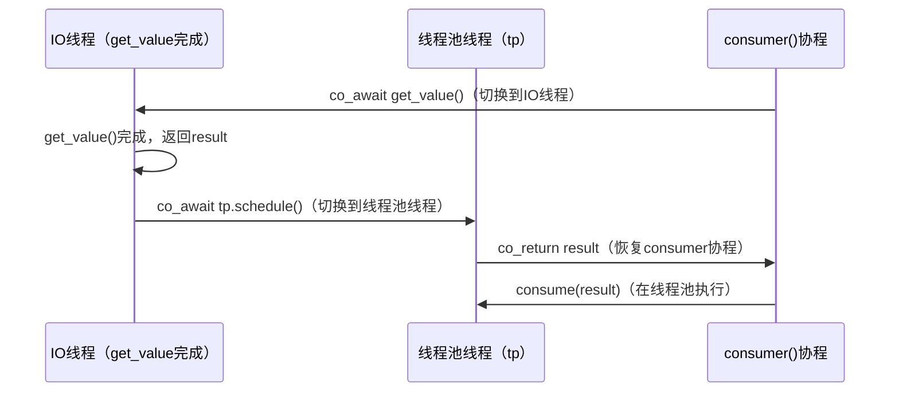
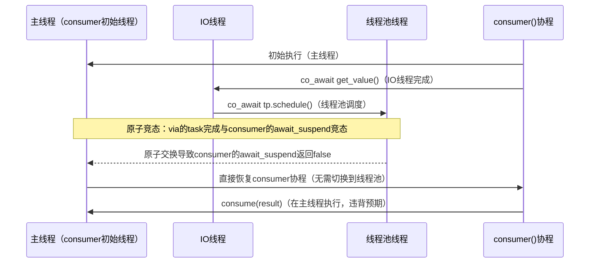
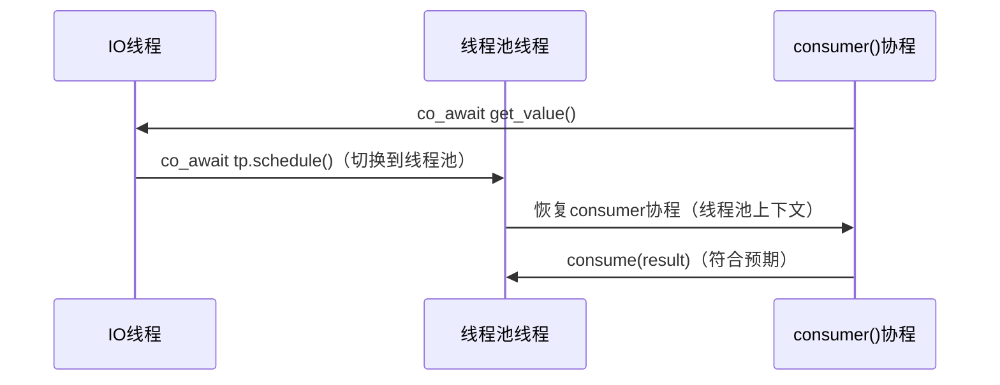

# via algo

### `via()`算法的深度解析

#### 1. 前置概念：执行上下文（Execution Context）

在解释`via()`之前，首先要明确**执行上下文**的含义：

- 对协程来说，**执行上下文**本质上是指协程代码运行时的**线程环境**（也可以是事件循环、调度器等抽象环境）。例如：
  - 协程A在主线程（ID:1）执行；
  - 协程B被调度到线程池的子线程（ID:2）执行；
  - 这两个协程处于不同的执行上下文。
- 在异步编程中，很多操作（如IO处理、数据消费）需要**严格绑定到特定的执行上下文**（比如UI线程、线程池），否则会出现线程安全问题（如UI控件只能在UI线程操作）或性能问题。

#### 2. `via()`算法的设计初衷
`via()`的核心目标是：**将一个异步操作（Awaitable）的结果，“搬运”到指定的调度器（Scheduler）的执行上下文中进行后续处理**。简单来说，它解决了以下问题：
- 异步操作`a`可能在任意线程（如IO线程）完成，但其结果的处理逻辑（如更新UI、消费数据）需要在**指定线程/调度器**（如UI线程、业务线程池）中执行。
- 若直接在`co_await a`后执行处理逻辑，处理逻辑的执行上下文是`a`完成的线程，无法保证一致性。
- `via()`算法则强制将后续逻辑切换到指定调度器的上下文，实现**上下文的确定性切换**。

#### 3. `via()`算法的核心逻辑与简化实现
你之前提到的`via()`简化版代码是理解其逻辑的关键，我们先贴出代码，再逐行解析：

```cpp
// 头文件依赖（示例）
#include <coroutine>
#include <type_traits>

// 辅助类型：提取Awaitable的返回类型（C++20的std::await_result_t，简化版）
template <typename Awaitable>
using await_result_t = std::invoke_result_t<decltype(&Awaitable::operator co_await), Awaitable>;
// 注：实际实现会更复杂，需处理Awaitable的各种形式（如普通函数、带await_transform的类型）

/**
 * @brief via算法的核心实现
 * @tparam Awaitable 任意可等待类型（如task<T>、future<T>等）
 * @tparam Scheduler 调度器类型（如线程池调度器、UI线程调度器）
 * @param a 异步操作（可等待对象）
 * @param s 指定的调度器（用于切换执行上下文）
 * @return task<await_result_t<Awaitable>> 包装后的可等待对象，结果在s的上下文返回
 */
template<typename Awaitable, typename Scheduler>
task<await_result_t<Awaitable>> via(Awaitable a, Scheduler s)
{
    // 步骤1：等待异步操作a完成，获取结果（此时执行上下文是a完成的线程）
    auto result = co_await std::move(a);
    // 步骤2：挂起当前协程，调度到指定的调度器s的执行上下文
    co_await s.schedule();
    // 步骤3：在s的上下文返回结果（后续逻辑会在s的上下文执行）
    co_return result;
}
```

##### 关键步骤解析：
1. **步骤1：`co_await std::move(a)`**
   - 执行异步操作`a`并等待其完成，获取结果`result`。
   - 此时协程的执行上下文是**`a`完成的线程**（可能是任意线程，如IO线程、随机的线程池线程）。
2. **步骤2：`co_await s.schedule()`**
   - `s.schedule()`是调度器提供的可等待对象，其作用是：**将当前协程挂起，并将其加入调度器`s`的任务队列，等待`s`的上下文（如线程池线程）唤醒**。
   - 这是`via()`算法的核心：**强制将协程的执行上下文从`a`的完成线程切换到`s`的上下文**。
3. **步骤3：`co_return result`**
   - 在`s`的执行上下文中返回结果，意味着**所有等待`via(a, s)`的协程，其后续逻辑都会在`s`的上下文执行**。

#### 4. `via()`算法的典型使用场景与预期行为
结合你之前的`consumer`例子，我们看`via()`的实际使用流程，并明确其**预期行为**：

```cpp
// 假设有以下前置定义：
template <typename T>
task<T> get_value(); // 异步获取值，可能在任意线程完成（如网络IO线程）
void consume(const T&); // 消费值，需要在指定线程池执行（线程安全要求）
cppcoro::static_thread_pool tp; // 全局线程池（调度器：tp.scheduler()）

task<void> consumer()
{
    // 步骤1：调用via算法，将get_value()的结果搬运到tp的线程池上下文
    T result = co_await via(get_value(), tp.scheduler());
    // 步骤2：消费结果（预期：在tp的线程池线程执行）
    consume(result);
}
```

##### 预期执行流程与上下文：


##### 核心预期：
`consume(result)`**必须**在`tp`的线程池上下文中执行，无论`get_value()`在哪个线程完成。这是`via()`算法的核心承诺。

#### 5. 原子方案下`via()`算法的失效原因（非确定性上下文）
在之前的原子方案（用`std::atomic`解决栈溢出）中，`via()`算法的核心承诺被打破，导致`consume(result)`的执行上下文不可控。我们详细分析原因：

##### （1）原子方案的恢复逻辑分叉
原子方案中，协程的恢复有两个可能的路径：
- **路径1（异步恢复）**：被await的协程（如`via()`返回的task）完成后，在其完成线程（如TP_thread）中调用`resume()`恢复`consumer`协程 → `consume(result)`在TP_thread执行（符合预期）。
- **路径2（同步恢复）**：`consumer`的`await_suspend`返回`false`，直接在原线程（如Consumer的初始线程，可能是主线程）恢复 → `consume(result)`在主线程执行（违背预期）。

##### （2）`via()`算法的失效过程


##### （3）失效的核心原因
原子方案的**非确定性恢复上下文**，导致`via()`算法的`co_await tp.schedule()`步骤被“短路”：
- 若`via()`返回的task完成时，`consumer`的`await_suspend`还在执行，原子交换可能让`consumer`直接在原线程恢复，跳过了`tp.schedule()`的上下文切换。
- 最终`consume(result)`在`consumer`的初始线程执行，而非`tp`的线程池，`via()`算法的核心目标失效。

#### 6. 对称转移方案下`via()`算法的正确性保障
对称转移（Symmetric Transfer）方案通过`await_suspend`返回`std::coroutine_handle`实现协程的无缝切换，从根源上保证了上下文的确定性，让`via()`算法恢复预期行为：

##### （1）对称转移的核心保障
- 协程的恢复逻辑**只有一个路径**：被await的协程完成后，在其完成线程中直接切换到续体（如`consumer`）的执行上下文，没有分叉、没有竞态。
- `via()`的`co_await tp.schedule()`步骤会**强制切换到`tp`的线程池上下文**，无法被短路。

##### （2）恢复后的执行流程


### 总结

`via()`算法是协程中**执行上下文管理**的核心工具，其关键要点如下：

1. **核心目标**：将异步操作的结果处理逻辑，强制切换到指定调度器的执行上下文。
2. **核心逻辑**：先等待异步操作完成，再通过调度器的`schedule()`切换上下文，最后返回结果。
3. **原子方案的问题**：非确定性的恢复上下文导致上下文切换被短路，算法失效。
4. **对称转移的优势**：上下文切换是确定的，保证`via()`算法的核心承诺（结果处理在指定上下文执行），且无原子操作、无额外分支开销。

`via()`算法的设计思想也被广泛应用于现代协程库（如cppcoro、Boost.Asio），是异步编程中处理线程安全和上下文一致性的标准方案。