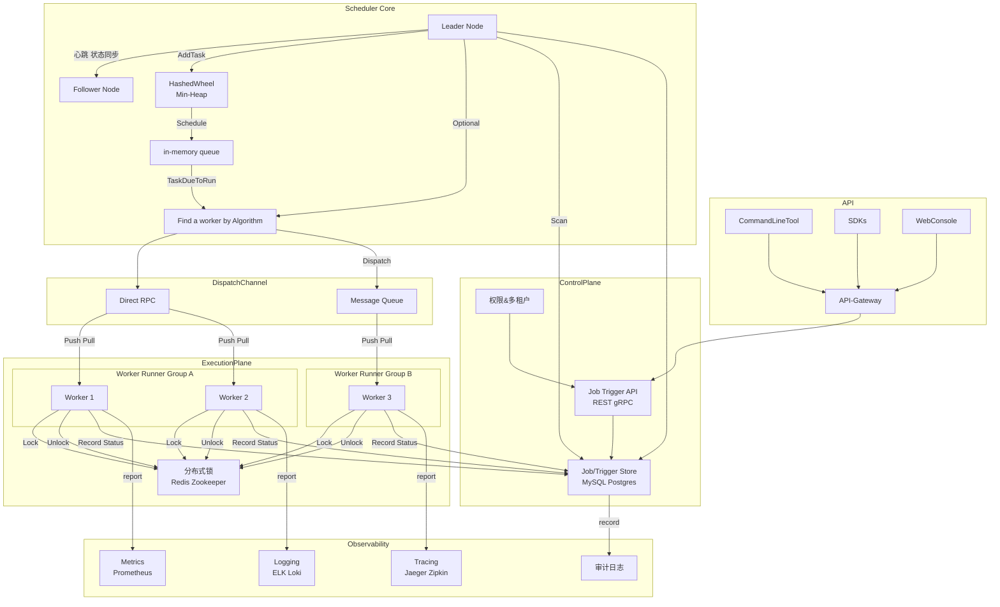

# How to Design a Job Scheduler

无论何种任务调度器，本质都是解决三个核心问题，这是理解所有设计的基础，也是区分不同调度器的核心维度：

1.  **何时执行**：任务的触发时机（即时执行、定点定时、周期性循环、事件驱动）；
2.  **在哪执行**：任务的运行载体分配（单机进程、分布式节点、容器、云函数）；
3.  **如何执行**：任务的全生命周期管控（容错重试、日志监控、优先级、超时终止、死信处理）。

Linux Cron Job和K8s Scheduler分别对应「单机轻量定时」和「分布式容器化资源调度」的极端场景，设计思路因场景需求差异显著，却为通用设计提供了核心借鉴。

## Linux Cron Job

Linux CronJob 是基于时间驱动的任务调度工具，其核心是 crond 守护进程周期性检查并执行预设任务，实现无人值守的自动化操作。下面从核心组件、调度流程、底层机制、补充组件四个维度，详解其调度原理。

Cron Job采用「守护进程+静态配置+简易执行引擎」的三元架构，无外部依赖，是单机调度的典范，核心组件及职责如下：

| 组件名称 | 核心作用 | 关键细节 |
|----------|----------|----------|
| `crond` 守护进程 | 调度核心，后台持续运行 | 系统启动自启（通过`systemd`/`init.d`管理），闲置时睡眠不占用CPU，每分钟精准唤醒执行一次核心调度逻辑 |
| Crontab 配置文件 | 任务元数据存储，定义「谁、何时、执行什么」 | 分两级存储，保证权限隔离与灵活性：<br>1.  用户级：`/var/spool/cron/<username>`，每个用户独立配置，通过`crontab -e`编辑，仅当前用户可执行；<br>2.  系统级：`/etc/crontab`、`/etc/cron.d/`，管理员配置，支持指定执行用户（如`root`） |
| `fork/exec` 执行引擎 | 任务实际落地执行 | 触发任务时，`crond`通过`fork`创建子进程（与主进程解耦，不阻塞后续调度），再通过`exec`加载目标脚本/命令，切换到目标用户权限执行 |
| 辅助组件（日志/权限） | 运维支撑与安全管控 | 日志：`/var/log/cron`记录任务触发、执行结果、错误信息，便于问题排查；<br>权限：`/etc/cron.allow`（白名单）/`/etc/cron.deny`（黑名单）控制用户是否可使用crontab功能 |

### 任务触发规则：Cron表达式（周期性定时的基石）

Cron Job的灵魂是**Cron表达式**，用简洁的字段描述周期性时间规则，也是后续众多定时调度器（如K8s CronJob、Quartz）的基础。
-  原生格式（5个字段，分钟级精度，Linux原生不支持秒/年）：`分 时 日 月 周`；
-  扩展格式（6/7个字段，主流调度框架支持）：`秒 分 时 日 月 周 [年]`；
-  特殊字符支持（实现灵活配置，覆盖绝大多数周期性场景）：
  - `*`：匹配该字段所有有效值（如「分」字段为`*`表示每分钟）；
  - `/`：指定步长（如`*/5`表示每5个单位，`0-59/10`表示每10分钟）；
  - `,`：枚举多个离散值（如`1,3,5`表示第1、3、5个单位）；
  - `-`：指定连续范围（如`1-5`表示第1到第5个单位）；
  - `?`：仅用于「日」和「周」字段，表示不关心该字段值（避免日与周冲突）；
-  经典示例：`0 3 * * 1` 表示「每周一凌晨3点整」执行，`*/10 * * * *` 表示「每10分钟」执行。

```shell
# 分钟 小时 日 月 星期
* * * * * command_to_execute
│ │ │ │ └─ 星期 (0-7, 0和7都表示周日)
│ │ │ └─── 月份 (1-12)
│ │ └───── 日 (1-31)
│ └─────── 小时 (0-23)
└───────── 分钟 (0-59)
```

### 调度核心逻辑：轮询+匹配

`crond`进程的调度逻辑极其简单，是一个单进程、多任务模型，自身不执行任务，而是通过 fork() 子进程的方式触发任务，避免主进程阻塞。

这也是它高稳定、低资源消耗的核心原因，核心步骤仅5步，每分钟循环一次：

1.  **睡眠唤醒**：`crond`通过`sleep()`系统调用实现精准每分钟唤醒（对齐系统时间整分），闲置期间无CPU占用，仅消耗少量内存；
2.  **配置加载**：唤醒后加载所有有效Crontab配置（用户级+系统级），缓存到内存（避免频繁读写磁盘，提升效率）；
3.  **时间匹配**：获取当前系统时间（分、时、日、月、周），对每个任务的Cron表达式进行逐字段匹配，判断是否满足触发条件；
4.  **任务执行**：匹配成功则立即`fork`子进程，切换到目标用户（系统级配置），通过`exec`执行指定脚本/命令，主进程不等待子进程结束，立即返回继续处理下一个任务；
5.  **结果记录**：子进程执行完成后，将执行状态（成功/失败）、输出信息、执行耗时写入`/var/log/cron`日志文件，完成本次调度循环。

```c
// 伪代码表示调度逻辑
while (true) {
    当前时间 = 获取系统时间();
    
    foreach (cron任务 in 所有任务) {
        if (任务.下次执行时间 <= 当前时间) {
            if (需要检查重叠执行 && 任务.上次实例仍在运行) {
                if (配置了防重叠) {
                    跳过本次执行;
                    continue;
                }
            }
            
            创建子进程执行任务;
            记录执行日志;
            计算任务.下次执行时间 = 计算下次触发时间(任务.时间表达式);
        }
    }
    
    睡眠(60 - 当前秒数);  // 精确到分钟边界
}
```

### 配置解析

`crond` 进程启动后，会按以下顺序加载配置文件（优先级从低到高）：

1. **系统级配置**：`/etc/crontab` → 全局任务，由 root 维护，支持指定执行用户（如 `* * * * * root /usr/bin/echo test`）。
2. **自定义系统任务**：`/etc/cron.d/*` → 第三方程序的 cron 配置，格式与 `/etc/crontab` 一致。
3. **用户级配置**：`/var/spool/cron/<username>` → 普通用户的个人任务，无需指定用户（默认以当前用户身份执行）。
4. **定时目录任务**：`/etc/cron.hourly/`/`daily`/`weekly`/`monthly` → 由 `run-parts` 工具批量执行目录内的脚本，无需编写时间表达式。

权限校验逻辑，`crond` 会先检查 `/etc/cron.allow` 文件：

- 若文件存在，**只有文件内列出的用户**可创建/执行 cron 任务；
- 若文件不存在，检查 `/etc/cron.deny`，**文件内列出的用户**被禁止使用 cron；
- 若两个文件都不存在，**仅 root 用户**有权限使用 cron。

### 一些设计权衡

#### 1. **Misfire (错过触发) 行为**
   
如果任务预定执行时，机器处于关机状态，会发生什么？标准的 crond 不会做任何事。它不会在系统重启后“补偿”执行错过的任务。因为它的设计模型非常简单：只关心“当前这一分钟”应该做什么。

为了解决这个问题，anacron 工具应运而生。它通常用于桌面或笔记本电脑，这些设备不会 24/7 运行。anacron 会记录任务的最后一次执行时间戳，并在系统启动时检查是否有任务错过了执行周期（如“天”、“周”），如果有，则立即执行它。
    
现代 Linux 系统中，systemd Timers 提供了比 cron 和 anacron 更强大和灵活的功能，例如秒级精度、更丰富的依赖关系、更好的日志集成以及处理错过任务的策略（通过 Persistent=true）。

#### 2. **时区与夏令时（DST）**

这是一个 cron 著名的“坑”。crond 使用其所在操作系统的系统时区来解释 crontab 中的时间。这在夏令时（DST）切换时会导致问题：
    
时钟向前拨快一小时（例如，从 02:00 变为 03:00）：如果你的任务恰好定在 02:30 执行，那么这一天它将不会被执行，因为 02:30 这个时间点“消失”了。
    
钟向后拨慢一小时（例如，从 02:00 回到 01:00）：如果你的任务定在 01:30 执行，它可能会被执行两次。

#### 3. **权限与安全**

- 用户隔离：每个用户的 crontab 任务默认以该用户的身份运行，保证了基本的权限隔离。
- cron.allow 与 cron.deny：管理员可以通过 /etc/cron.allow 和 /etc/cron.deny 文件来精确控制哪些用户可以使用 crontab 命令。
  - 如果 cron.allow 存在，则只有列在其中的用户可以使用。
  - 如果 cron.allow 不存在但 cron.deny 存在，则列在 cron.deny 中的用户不能使用。
- MTA 集成：MAILTO 功能依赖于一个正常工作的邮件传输代理（MTA），如 sendmail 或 postfix。如果系统没有配置 MTA，邮件通知将失败。

---

## K8s Scheduler：分布式容器化任务的工业级资源调度

Kubernetes Scheduler（kube-scheduler）是 K8s 控制平面的核心组件，其核心职责是为未调度的 Pod 匹配最优的 Node 节点，实现集群资源的高效利用与业务稳定性保障。调度器的工作本质是 **“筛选 - 打分 - 绑定”** 的闭环流程，并通过插件化框架支持高度灵活的扩展。

kube-scheduler 采用**插件化架构**，基于 **Scheduler Framework**（K8s 1.15+ 引入）实现，核心组件包括：

| 组件 | 作用 | 一些细节 |
|------|------|----------|
| **kube-scheduler 进程** | 调度器主进程，运行在控制平面 | 默认监听 `127.0.0.1:10259`，通过 API Server 监听 Pod 资源事件 <br>多实例部署（运行在`kube-system`命名空间），通过「领导者选举」避免单点故障，仅领导者执行调度逻辑，非领导者待命（故障时快速切换）；|
| **调度配置** | 定义调度器的行为与插件启用规则 | 配置文件路径（默认）：`/etc/kubernetes/scheduler.conf`，支持自定义插件顺序与参数 |
| **调度队列** | 管理待调度 Pod 的优先级与顺序 | 分为 **活跃队列（Active Queue）** 和 **备用队列（Standby Queue）**，支持优先级排序 |
| **调度插件** | 实现调度核心逻辑（过滤、打分等） | 内置插件：`NodeResourcesFit` `NodeAffinity` 等；支持自定义插件注入 |
| **API Server 交互层** | 读取集群状态（Node/Pod）、写入绑定结果 | 调度器不直接操作 Node，仅通过 API Server 完成资源状态查询与绑定，保证集群一致性 |
| **ETCD** | 集群状态持久化存储 | 存储所有Pod、Node、Namespace等资源的元数据和状态，保证数据强一致性，是调度器的「数据来源」和「调度结果落地」的唯一可信源； |
| **Node 节点（含`kubelet`）** | 任务执行载体 | 每个节点的`kubelet`持续向APIServer上报节点状态（CPU/内存/磁盘资源、污点、标签、健康状态），接收调度结果并启动/停止/监控Pod； |

上述架构具有以下优点：

1. **无状态设计**：kube-scheduler 本身不存储集群状态，所有状态均从 API Server 获取，支持多实例部署（通过 leader 选举避免冲突）。
2. **插件化扩展**：基于 Scheduler Framework 提供 10+ 扩展点（如 `QueueSort` `Filter` `Score` `Bind`），用户无需重写整个调度器，仅需开发插件即可定制调度逻辑。
3. **多调度器支持**：Pod 可通过 `spec.schedulerName` 指定自定义调度器（默认 `default-scheduler`），实现多租户/多业务的调度隔离。

### 核心调度全流程

kube-scheduler 为单个 Pod 的调度分为 **4 个核心阶段**，整个流程是**原子性**的，避免同一 Pod 被调度到多个 Node。

#### 阶段 1：入队&排序（QueueSort）

当集群中出现**未调度 Pod**（`spec.nodeName` 为空）时，Pod 会被加入调度队列，核心逻辑如下：

1. **入队触发条件**
   1. 用户新建 Pod 且未指定 `nodeName`；
   2. Node 故障导致已调度 Pod 被驱逐，重新进入调度队列；
   3. 亲和性/污点策略变更，触发 Pod 重新调度。
2. **队列分层与排序**
   1. **活跃队列**：存放高优先级待调度 Pod，调度器优先处理此队列，保证高优先级任务（如核心服务）优先调度；
   2. **备用队列**：存放低优先级 Pod，活跃队列处理完毕后才会消费此队列；
   3. **排序规则**：通过 `QueueSort` 插件实现，默认按 **Pod 优先级**（`spec.priorityClassName`）降序排列，优先级越高的 Pod 越先被调度。

#### 阶段 2：过滤（Filter）

预选阶段的目标是**排除所有不满足 Pod 运行条件的 Node**，是**硬性条件过滤**，只有全部满足规则的 Node 才能进入下一阶段。

调度器会遍历集群中所有健康 Node，对每个 Node 执行一系列**过滤规则**（由 `Filter` 插件实现），一些常见规则如下：

| 过滤规则（内置插件） | 核心检查逻辑 | 典型场景 |
|----------------------|--------------|----------|
| `NodeResourcesFit` | Node 的剩余 CPU/内存/显存等资源 ≥ Pod 请求的资源（`spec.resources.requests`） | 避免 Pod 调度到资源不足的 Node，防止资源耗尽 |
| `PodFitsHostPorts` | Pod 申请的主机端口（`spec.hostPort`）未被 Node 上其他 Pod 占用 | 避免端口冲突导致 Pod 启动失败 |
| `NodeSelectorMatch` | Node 标签匹配 Pod 的 `spec.nodeSelector` 规则 | 强制将 Pod 调度到指定标签的 Node（如 SSD 节点） |
| `NoDiskConflict` | Pod 挂载的存储卷（如 PVC）与 Node 上已挂载卷无冲突 | 避免存储卷多节点挂载导致的数据一致性问题 |
| `TaintToleration` | Node 的污点（Taint）被 Pod 的容忍（Toleration）匹配 | 排除 Pod 无法容忍的污点 Node（如污点 `NoSchedule` 会阻止无容忍的 Pod 调度） |

过滤阶段是**并行执行**的，调度器会同时检查多个 Node，提升大规模集群的调度效率。

### 阶段 3：打分（Score）

**对预选通过的 Node 进行打分，选出得分最高的 Node**，是**软性条件优化**，核心逻辑是**加权求和**。

1. **打分流程**
   - 遍历所有预选通过的 Node；
   - 对每个 Node 执行一系列**打分规则**（由 `Score` 插件实现），每个规则输出 0-100 分的分数；
   - 根据插件权重（可配置）计算 Node 最终得分：`最终得分 = Σ(插件得分 × 插件权重)`；
   - 得分最高的 Node 成为**最优候选 Node**。

2. **常见打分规则（内置插件）**
   | 打分规则 | 核心逻辑 | 权重（默认） | 适用场景 |
   |----------|----------|--------------|----------|
   | `LeastRequestedPriority` | Node 资源使用率越低，得分越高（公式：`(1 - CPU使用率) × 0.5 + (1 - 内存使用率) × 0.5`） | 1 | 追求资源利用率提升，适合批处理任务 |
   | `BalancedResourceAllocation` | Node 的 CPU/内存使用率越接近，得分越高 | 1 | 避免单一资源耗尽，适合混合负载集群 |
   | `NodeAffinityPriority` | Node 匹配 Pod 节点亲和性规则的程度越高，得分越高 | 1 | 满足业务对 Node 的偏好（如靠近机房 A） |
   | `ImageLocalityPriority` | Node 上已存在 Pod 所需镜像，得分越高 | 1 | 减少镜像拉取时间，提升 Pod 启动速度 |

3. **平局处理**
   若多个 Node 得分相同，默认按 **Node 名称字典序**选择，也可通过插件自定义平局策略。

#### 阶段 4：绑定（Bind）

将 Pod 与最优 Node 建立关联，保证集群状态一致性。

1. **预绑定（PreBind）**：执行一些前置操作，如挂载持久化存储卷（PVC → PV）。
2. **节点绑定**：调度器通过 API Server 发送 **Binding 请求**，将 Pod 的 `spec.nodeName` 设置为目标 Node 名称。
   - 此操作是**原子性**的，API Server 会保证同一 Pod 不会被多个调度器绑定；
   - 若绑定失败（如 Node 突然宕机、资源被抢占），Pod 会被重新放回调度队列，触发新一轮调度。
3. **后绑定（PostBind）**：执行一些后置操作，如清理调度过程中的临时状态。

### 关键扩展机制

kube-scheduler 的灵活性源于丰富的扩展机制，这些机制是实现复杂调度策略的核心。

1. 亲和性（Affinity）与反亲和性（Anti-Affinity）

- **节点亲和性（Node Affinity）**：Pod 对 Node 的偏好，等价于增强版 `nodeSelector`，支持**软策略**（`preferredDuringSchedulingIgnoredDuringExecution`，调度不上也没关系）和**硬策略**（`requiredDuringSchedulingIgnoredDuringExecution`，必须满足）。
  示例：优先调度到带有 `disk-type: ssd` 标签的 Node。
- **Pod 亲和性/反亲和性（Pod Affinity/Anti-Affinity）**：Pod 之间的偏好，基于**已运行 Pod 的标签**进行调度。
  - 亲和性：将相关服务 Pod 调度到同一 Node/拓扑域（如同一机架），减少网络延迟；
  - 反亲和性：将同一服务的多个 Pod 调度到不同 Node/拓扑域，实现容灾（如避免单节点故障导致服务不可用）。

2. 污点（Taint）与容忍（Toleration）：污点是 Node 的**排斥性标记**，容忍是 Pod 的**豁免权**，核心是实现**Node 级别的访问控制**，典型场景：

- 标记 `master` 节点为 `node-role.kubernetes.io/master:NoSchedule`，防止普通 Pod 调度到控制平面；
- 标记故障 Node 为 `node.kubernetes.io/unreachable:NoExecute`，驱逐已运行 Pod 并阻止新 Pod 调度；
- 为特殊 Pod（如监控、日志）添加容忍，允许其调度到带污点的 Node。

3. Pod 优先级与抢占

- **优先级**：通过 `PriorityClass` 定义 Pod 优先级，高优先级 Pod 优先进入活跃队列；
- **抢占**：当集群资源不足时，高优先级 Pod 可**抢占**低优先级 Pod 的资源——驱逐低优先级 Pod，将其调度到目标 Node。
  抢占逻辑：高优先级 Pod 预选阶段无可用 Node → 寻找能通过预选但资源不足的 Node → 驱逐 Node 上优先级最低的 Pod → 释放资源后完成调度。

4. 调度框架扩展点：Scheduler Framework 提供了标准化的扩展点，用户可通过开发插件定制调度逻辑，核心扩展点如下：

```shell
# 调度框架扩展点
Extension Points:
  - QueueSort: 排序Pod
  - PreFilter: 预处理检查
  - Filter: 节点过滤
  - PreScore: 打分预处理
  - Score: 节点打分
  - Reserve: 资源预留
  - Permit: 批准/拒绝
  - PreBind: 绑定前处理
  - Bind: 执行绑定
  - PostBind: 绑定后处理
```

### 性能优化机制

在大规模集群（万级 Node）中，调度器的性能至关重要，kube-scheduler 通过以下机制保证调度效率：

1. **调度缓存（Scheduler Cache）**
   调度器会缓存 Node、Pod 等核心资源的状态，避免每次调度都从 API Server 拉取全量数据，缓存会通过 **Informer 机制**实时更新，保证与集群状态一致。
2. **并行调度**
   过滤和打分阶段支持**并行处理多个 Node**，通过 Goroutine 实现并发，大幅减少单 Pod 调度耗时。
3. **调度分片（Scheduling Sharding）**
   多实例调度器通过 **Leader 选举**和**分片策略**，将集群 Node 划分为多个分片，每个调度器只负责一个分片的 Pod 调度，避免单调度器瓶颈。
4. **延迟调度（Deferred Scheduling）**
   对刚启动的 Node 或刚释放资源的 Node，延迟一段时间再调度 Pod，避免因 Node 状态不稳定导致的调度失败。

---

## 通用Job Scheduler的设计思路（兼顾多场景、高可用、可扩展）

### Job Scheduler 再解读

简单来说，Job Scheduler（任务调度器）就是为代码或程序配置的“闹钟”。通过预先设定好规则，调度器会在指定的时间或条件下，自动执行这些任务。

它的核心职责是回答两个问题：“何时执行？” 与 “在哪执行？”。根据对这两个问题的不同侧重，调度器可以分为两大类：

- **时间触发调度 (Time-based Scheduling)**：更关心“何时执行”。这类调度器专注于根据预设的时间点（如每天凌晨 2 点）、时间间隔（如每 5 分钟）或日历规则来触发任务。Linux Cron 是其最经典的代表。
- **资源调度 (Resource-based Scheduling)**：更关心“在哪执行”。这类调度器负责在资源池（如服务器集群）中，为任务（如一个容器或应用实例）寻找最合适的“家”。它需要综合考虑节点的 CPU、内存、存储、网络以及各种复杂的策略（如亲和性、污点），来做出最优决策。

在深入设计之前，理解以下几个通用概念至关重要，它们是衡量任何一个调度系统成熟度的关键标尺：

1. **一致性语义 (Consistency Semantics)**：调度系统对任务执行的承诺是什么？
   - **At-least-once (至少一次)**：这是最常见和实用的模型。系统保证任务至少会被成功执行一次。在网络分区、节点故障等异常情况下，任务可能会被重复执行。因此，它强烈依赖任务自身的幂等性来保证最终结果的正确性。
   - **Exactly-once (精确一次)**：最严格的模型，保证任务在任何情况下都不多不少，只被成功执行一次。这在技术上实现成本极高，通常需要分布式事务、状态快照和原子提交等复杂机制的配合。对于绝大多数业务场景，追求绝对的“精确一次”性价比很低。
  
2. **幂等性 (Idempotency)**：幂等性是指一个操作无论执行一次还是多次，其产生的影响和结果都是相同的。它是实现 At-least-once 语义的基石。
    - 示例：一个“创建订单”的任务，如果简单地执行数据库 INSERT，重复执行就会创建多笔相同订单。但如果引入一个唯一的“订单请求 ID”，在执行 INSERT 前先检查该 ID 是否已存在，任务就变得幂等了。

3. **重试与补偿 (Retry & Compensation)**
   - **重试 (Retry)**：当任务执行失败时（如网络超时、依赖服务不可用），调度系统应具备自动重试的能力。简单的立即重试可能会加剧下游系统压力，因此通常会采用指数退避（Exponential Backoff）等策略，逐步拉长重试间隔。
   - **补偿 (Compensation)**：当一个由多个步骤组成的业务流程失败时，仅仅重试失败的步骤可能不够。补偿是指执行一个“反向操作”，以撤销已经成功完成的步骤，使系统状态回滚。例如，订单创建成功但支付失败，补偿操作可能就是“取消订单”。

### 需求分析

从需求视角来看：一个现代调度器应该具备什么？

- 触发类型 (Trigger Types)：
  - Cron 表达式：兼容标准 Cron，提供灵活的周期性调度。
  - 固定频率 (Fixed Rate/Delay)：例如，“每隔 5 分钟执行一次”。
  - 日历与例外 (Calendar & Exclusions)：支持复杂的日历逻辑，如“每个月的最后一个工作日”，并能排除特定日期（如法定节假日）。
  - 执行窗口 (Time Windows)：定义任务只能在某个时间窗口内运行（白名单），或者不能在某个窗口内运行（黑名单）。
  - 一次性任务 (One-shot)：在未来的某个特定时间点执行一次。
- 执行语义 (Execution Semantics)：
  - 幂等性与去重：系统应提供机制来辅助实现幂等性，例如为每次触发生成唯一的 invocation_id，并提供分布式锁防止重复执行。
  - 并发策略 (Concurrency Policy)：当一个任务的下一次触发时间到达，但上一次执行还未结束时，系统应如何处理？
    - Forbid：禁止并发执行，跳过本次触发。
    - Allow：允许并发执行，新老任务并行。
    - Replace：用新任务替换掉正在运行的老任务。
  - Misfire 策略：当任务因调度器宕机等原因错过触发点时，恢复后应如何处理？
    - Skip：跳过所有错过的触发。
    - FireOnceNow：立即补发一次。
    - FireAllMissed：补发所有错过的触发。
  - Catch-up / Backfill (补数据)：支持手动触发一个任务，并回溯执行过去某个时间段内的所有周期。
- 多租户与配额 (Multi-tenancy & Quotas)：
  - 公平性：当大量任务同时到期时，如何确保不同租户或不同优先级的任务能公平地获得执行机会？可以借鉴 DRF (Dominant Resource Fairness) 思想，平衡不同维度的资源分配。
  - 优先级与抢占：高优先级的任务应该能优先被调度和执行，甚至在资源紧张时抢占低优先级任务。
  - 速率限制与背压 (Rate Limiting & Backpressure)：当任务执行速度跟不上生产速度时，Worker 应能向上游（调度器或消息队列）反馈压力，减缓任务分发速度，防止系统雪崩。

### 设计目标

1.  通用性：支持多种任务类型、执行载体、触发方式，无需重构即可适配不同业务场景；
2.  高可用：无单点故障，任务不丢失、不重复执行，支持故障转移和容灾；
3.  高性能：支持十万级/百万级任务调度，调度延迟低（毫秒级），支持大规模任务分片；
4.  可扩展：支持自定义调度策略、执行器、存储插件，降低二次开发成本；
5.  容错性：完善的重试、死信、告警机制，支持任务全生命周期管控；
6.  可观测：完善的监控、日志、可视化面板，便于运维排查问题和性能优化。

### 架构分层

核心功能解耦，每层通过标准化接口交互，支持插件化扩展，避免紧耦合，提升系统的灵活性和可维护性，架构如下：

```
┌─────────────────────────────────────────────────────────┐
│ 第一层：接入层（任务接收、校验、标准化、多入口）        │ 【任务入口，解耦输入】
├─────────────────────────────────────────────────────────┤
│ 第二层：存储层（任务持久化、集群状态、调度结果）        │ 【数据一致性与持久化保障】
├─────────────────────────────────────────────────────────┤
│ 第三层：调度核心层（定时触发、资源调度、决策引擎）      │ 【核心：解决何时/在哪执行】
├─────────────────────────────────────────────────────────┤
│ 第四层：执行层（任务执行、执行器池、容错、结果回调）    │ 【任务落地执行与管控】
├─────────────────────────────────────────────────────────┤
│ 第五层：监控与运维层（可视化、告警、日志、运维API）     │ 【可观测性与运维支撑】
└─────────────────────────────────────────────────────────┘
```

一个简单的架构示意图如下



**ControlPlane**

- API & UI：提供 RESTful API 和 Web 界面，供用户和外部系统创建、管理、监控任务。
- Job/Trigger Store (任务存储)：持久化存储 Job（任务定义）和 Trigger（触发器规则）的信息。持久化所有核心数据，保证任务不丢失、状态可追溯，支持单机/分布式部署，插件化存储选型；分布式场景下采用Raft/Paxos协议（ETCD）或数据库事务，避免数据不一致（如任务重复分配、状态错乱）；将热点数据（待调度任务、节点状态）缓存到内存，减少存储访问开销，提升调度性能；
  -  核心存储数据：
    1. 任务元数据：通用任务模型、触发规则、执行配置、容错配置、优先级；
    2. 集群状态：节点信息（资源、健康状态、标签、执行器状态）、调度器状态、集群拓扑；
    3. 运行数据：调度记录、执行结果、日志地址、重试记录、死信队列数据；
- 权限与多租户模块：负责认证和授权，确保用户只能操作其有权限的任务，并实现租户间的资源隔离。

**Scheduler Core**

- Leader 选举与 HA：调度器核心通常以多实例（Leader + Followers）模式部署以实现高可用。通过 ZooKeeper 或 Raft 协议（如 Etcd）进行 Leader 选举，确保在任何时刻只有一个实例在进行实际的调度决策。Followers 作为热备，随时准备在 Leader 宕机时接管。
- **触发模块** 
  - 时间轮 (Hashed Wheel) vs. 最小堆 (Min-Heap)：这是实现定时触发的两种经典数据结构。
    - 时间轮：类似于一个时钟，指针每秒（或每毫秒）移动一格，格子里存放着将在该时刻到期的任务。插入和删除操作的时间复杂度为 O(1)，非常高效，适合任务量巨大且对精度要求不是极高的场景。
    - 最小堆：将所有待执行的任务按其下一次触发时间构建一个最小堆，堆顶永远是最近将要到期的任务。每次取出堆顶任务执行，并计算其下一次触发时间，再重新插入堆中。它精度更高，但每次操作复杂度为 O(log N)，在任务量极大时性能可能不及时间轮。
  - 事件驱动 (Event-driven)：Leader 节点从 Store 中加载即将到期的任务到内存（时间轮或最小堆）。当任务到期时，它不是直接执行，而是生成一个“触发事件”，并将该事件推送到分发通道。这种事件驱动的设计将“决定何时触发”和“如何分发执行”解耦。
- **资源调度模块**：将任务分配到最优节点/执行器，兼顾可行性和最优性，支持单机/分布式、容器/非容器场景，插件化扩展调度规则
  1.  **预选（Predicates）—— 硬约束过滤**：
     -  内置默认规则：资源充足、节点健康、标签匹配、端口不冲突、存储可用；
     -  自定义规则：插件化添加（如异构架构匹配、网络带宽限制、成本管控、业务权限校验）；
     -  输出：可行节点/执行器集；
  2.  **优选（Priorities）—— 软约束打分**：
     -  内置默认规则（可配置权重）：资源使用率均衡、负载均衡、亲和性匹配、执行器性能优先、成本优先；
     -  自定义规则：插件化添加（如就近部署、业务优先级、容灾需求、历史执行成功率）；
     -  输出：得分最高的节点/执行器；
  3.  **绑定与容错**：分布式锁避免重复分配，无可行节点时支持任务排队、告警、降级到备用节点，记录绑定日志。

**Dispatch Channel**

- 消息队列 (Message Queue)：如 Kafka, RabbitMQ。这是最常用和推荐的分发方式。调度器核心将触发事件作为消息发送到 MQ，Worker 从 MQ 中消费这些消息。MQ 天然地提供了削峰填谷、负载均衡和持久化能力。
- 直接 RPC 调用：对于一些特殊的、需要低延迟响应的任务，调度器也可以直接通过 RPC 调用 Worker。这种方式耦合度更高，但省去了 MQ 的延迟。

**Execution Plane**

- Worker/Runner：实际执行任务的进程或节点。它们可以被组织成不同的 Worker Group，订阅不同的任务类型。
  1.  执行器池（Executor Pool）：管理执行器实例，池化复用（避免频繁创建销毁，提升性能），支持多种执行器类型（插件化扩展）：
     -  本地执行器：执行本地脚本、命令、独立进程（兼容Linux Cron Job）；
     -  容器执行器：启动Docker/K8s容器执行任务（兼容K8s）；
     -  远程执行器：通过SSH/GRPC调用远程节点执行任务；
     -  云执行器：调用云服务（如AWS Lambda、阿里云函数计算、腾讯云SCF）执行任务；
  2.  执行监控器：实时采集任务执行状态（运行中/成功/失败）、资源消耗（CPU/内存/磁盘）、执行日志、执行耗时；
  3.  容错控制器：配置化重试（次数、间隔、退避策略）、死信队列（多次失败后入队，避免无限重试，便于人工排查）、失败告警（邮件/短信/钉钉/企业微信）、任务超时终止、僵尸任务清理；
- Push vs. Pull 模式：
  - Push：调度器（或 MQ）将任务直接推送给 Worker。
  - Pull：Worker 主动向调度器（或 MQ）拉取任务。Pull 模式更利于 Worker 根据自身负载进行流控。
- 执行锁与去重 (Distributed Lock)：为了实现 At-least-once + 幂等，Worker 在执行任务前，需要基于一个唯一的 invocation_id 去获取一个分布式锁（如基于 Redis 的 SETNX 或 ZooKeeper 的临时节点）。如果获取锁失败，说明有其他 Worker 正在执行同一个任务，当前 Worker 就直接放弃。

**Observability**

- 状态与运行记录：所有任务的创建、修改、触发、执行开始、执行成功/失败等状态都应被详细记录到 Store 中，用于审计和问题排查。
- Metrics/Alerting/Tracing：
  1.  监控指标：采集调度吞吐量、调度延迟、节点使用率、任务成功率、失败率、重试率等指标，对接Prometheus/Grafana，支持自定义指标扩展；
  2.  日志系统：收集调度器日志、任务执行日志、容错日志，支持查询、过滤、归档、全文检索，对接ELK Stack/ Loki；
  3.  可视化面板：任务列表、执行记录、节点状态、告警信息、资源使用率的可视化展示，支持任务的增删改查、暂停/恢复/删除；
  4.  运维工具：API/CLI支持节点注册/下线、调度策略配置更新、容错规则调整、数据备份/恢复。


### 通用任务模型（标准化，适配多场景）

通用Job Scheduler的关键是「通用任务模型」，将所有任务标准化，适配不同接入方式和执行器，确保各层流程的统一性，例如（JSON格式示例）：

```json
{
  "jobId": "job-123456",          // 全局唯一任务ID，用于追踪和去重
  "jobName": "全量数据备份任务",   // 任务名称（便于人工识别）
  "jobType": "PERIODIC",          // 任务类型：INSTANT（即时）/TIMED（定点）/PERIODIC（周期性）
  "triggerConfig": {              // 触发配置（对应任务类型，插件化）
    "cronExpression": "0 3 * * *",// 周期性任务：Cron表达式
    "triggerTime": "2026-01-15 10:00:00.000", // 定点任务：绝对时间
    "timeZone": "Asia/Shanghai"   // 时区配置
  },
  "execConfig": {                 // 执行配置（对应执行器类型，插件化）
    "executorType": "LOCAL",      // 执行器类型：LOCAL/CONTAINER/REMOTE/CLOUD
    "executorParams": {
      "command": "/usr/bin/backup.sh",
      "args": ["--dir", "/data", "--keep", "7"],
      "timeout": 3600,            // 任务最大运行时间（秒）
      "outputPath": "/var/log/backup/" // 日志输出路径
    }
  },
  "resourceConfig": {             // 资源请求配置
    "cpuRequest": "1C",
    "memoryRequest": "2G",
    "storageRequest": "10G"
  },
  "faultToleranceConfig": {       // 容错配置
    "retryCount": 3,              // 重试次数
    "retryInterval": 60,          // 重试间隔（秒）
    "retryStrategy": "EXPONENTIAL", // 重试策略：固定间隔/指数退避
    "enableDeadLetterQueue": true // 是否启用死信队列
  },
  "priority": 8,                  // 任务优先级（1-10，越高越优先调度）
  "labels": {                     // 任务标签（用于亲和性匹配、筛选、分组）
    "env": "production",
    "business": "data-storage",
    "owner": "dev-ops"
  },
  "createTime": "",
  "updateTime": ""
}
```

### 一些关键逻辑的伪代码示例

Cron 解析与下一触发时间计算

> 时间与时区：所有时间在内部存储和计算时，强烈建议统一使用 UTC。每个任务可以独立配置其 timeZone 属性。在计算下一触发时间或展示给用户时，再根据任务的时区进行转换。这能彻底避免夏令时（DST）和服务器时区变更带来的混乱。


```go
function getNextTriggerTime(cronExpression, lastTriggerTime, timeZone) {
    // 1. 解析 Cron 表达式（例如 "0 15 10 * * ?"）
    CronDefinition cronDef = CronParser.parse(cronExpression);

    // 2. 从上一次触发时间点开始，逐秒（或逐分）递增
    ZonedDateTime nextTime = ZonedDateTime.of(lastTriggerTime, timeZone);
    while (true) {
        nextTime = nextTime.plusSeconds(1);

        // 3. 检查递增后的时间是否匹配所有 Cron 字段
        if (cronDef.matches(nextTime)) {
            // 4. 如果匹配，则返回该时间点
            return nextTime;
        }
    }
}
```

调度策略选择

```go
type SchedulingStrategyFactory struct {
    strategies map[string]SchedulingStrategy
}

func (f *SchedulingStrategyFactory) GetStrategy(jobType string, constraints *Constraints) SchedulingStrategy {
    switch jobType {
    case "batch":
        return &BatchSchedulingStrategy{
            policy: "spread",
        }
    case "online":
        return &OnlineSchedulingStrategy{
            policy: "pack",
        }
    case "ml":
        return &MLSchedulingStrategy{
            affinity:   "gpu",
            gang:       true,
        }
    default:
        return &DefaultSchedulingStrategy{
            policy: "balanced",
        }
    }
}
```

幂等键与执行锁

```go
func executeTask(task Task, invocationId string) {
    lockKey := "scheduler:lock:" + invocationId
    
    // 2. 尝试获取分布式锁，并设置一个合理的过期时间（防止Worker崩溃导致死锁）
    acquired, err := redisClient.SetNX(lockKey, "locked", 30 * time.Minute).Result()
    if err != nil || !acquired {
        log.Printf("Failed to acquire lock for %s, another worker is running it.", invocationId)
        return // 获取锁失败，直接返回
    }
    defer redisClient.Del(lockKey)

    runBusinessLogic(task)
}
```

批处理优化

```go
type BatchScheduler struct {
    batchSize    int
    batchTimeout time.Duration
    processor    *BatchProcessor
}

func (b *BatchScheduler) Schedule(tasks []*Task) []*ScheduleResult {
    batches := b.batchTasks(tasks, b.batchSize)
    
    results := make(chan *BatchResult, len(batches))
    
    for _, batch := range batches {
        go func(batch []*Task) {
            result := b.processBatch(batch)
            results <- result
        }(batch)
    }
    
    return b.mergeResults(results, len(batches))
}
```

DAG Workflow

```go
type Workflow struct {
    Name        string
    Version     string
    Steps       []*Step
    DAG         *DAG
    RetryPolicy *RetryPolicy
    Timeout     time.Duration
}

type DAG struct {
    Nodes map[string]*Node
    Edges []*Edge
}

type WorkflowExecutor struct {
    stateMachine *StateMachine
    dagExecutor  *DAGExecutor
    compensator  *CompensationManager
}

func (we *WorkflowExecutor) Execute(workflow *Workflow, inputs map[string]interface{}) error {
    if err := workflow.Validate(); err != nil {
        return err
    }
    
    sortedNodes := we.dagExecutor.TopologicalSort(workflow.DAG)
    
    results := we.executeParallel(sortedNodes, inputs)
    
    return we.processResults(results)
}
```

### 一些容易踩坑的点

在设计和使用调度系统时，以下这些问题是反复出现且极易出错的地方：

1. **时间语义的混乱**
  - 问题：在分布式系统中，服务器时区不统一、夏令时切换、系统时钟漂移，都会导致调度时间的混乱和不可预测。
  - 最佳实践：
    - 强制使用 UTC：所有后端服务、数据库、日志，时间戳一律使用 UTC 存储和计算。
    - 时区作为任务属性：将时区（如 Asia/Shanghai）作为任务的一个配置项，在与用户交互或计算日历逻辑时才进行转换。
2. **重试风暴**
  - 问题：当一个下游服务故障时，调度器触发的大量任务持续重试，瞬间压垮刚刚恢复的服务。
  - 最佳实践：
    - 采用指数退避策略：例如，重试间隔可以从 1s -> 2s -> 4s -> 8s... 直到达到一个上限。
    - 为重试设置上限：无论是按次数还是按总时长，达到上限后应将任务标记为“失败”并告警，转为人工处理。
3. **缺乏幂等性**
  - 问题：在 At-least-once 语义下，重复执行的任务（如重复创建订单、重复发送邮件）导致业务数据错乱。
  - 最佳实践：
    - 从业务层面设计幂等：
      - 唯一请求 ID：调度器为每次触发生成唯一 ID，Worker 执行前检查该 ID 是否已处理。
      - 状态机：对于涉及状态变更的操作，检查当前状态是否允许执行该操作（例如，只有“待支付”的订单才能被“支付”）。
      - 数据库唯一约束：利用数据库的 UNIQUE 索引来防止重复插入。
4. **孤儿任务**
  - 问题：Worker 节点在执行任务期间崩溃或失联，但它持有的分布式锁未被释放，导致该任务永远无法被再次调度。
  - 最佳实践：
    - 为锁设置合理的 TTL：分布式锁必须设置一个过期时间，该时间应略长于任务的平均执行耗时。
    - Worker 心跳与续租：对于长耗时任务，Worker 应定期向锁服务发送“心跳”，延长锁的 TTL，表明自己仍在健康运行。
5. **调度器与执行者强耦合**
  - 问题：调度器直接 RPC 调用 Worker，当 Worker 数量庞大或处理慢时，调度器线程被大量阻塞，自身吞吐量下降，甚至崩溃。
  - 最佳实践：
    - 引入消息队列解耦：调度器只负责将“触发事件”发送到 MQ，然后立即返回处理下一个任务。这种异步解耦能极大地提升调度器的吞吐和稳定性。
6. **权限与资源隔离不足**
  - 问题：在多租户环境下，一个租户的恶意或有问题的任务（如死循环脚本）耗尽了所有 Worker 资源，导致其他所有租户的任务被“饿死”。
  - 最佳实践：
    - Worker 分组/资源隔离：使用不同的 Worker Group 服务于不同的租户或业务线，并配置资源配额（如 Cgroups, Kubernetes limits）。
    - 精细化的权限控制：提供基于角色的访问控制（RBAC），严格限制用户只能访问和操作自己的任务。
    - 任务沙箱：对于执行不可信代码的场景，应使用容器、gVisor 或 wasm 等沙箱技术来运行任务，限制其对系统资源的访问。

## Ref

- [Cron Jobs: The Complete Guide for 2025](https://cronitor.io/guides/cron-jobs)
- [kube-scheduler](https://kubernetes.io/zh-cn/docs/concepts/scheduling-eviction/kube-scheduler/#kube-scheduler)