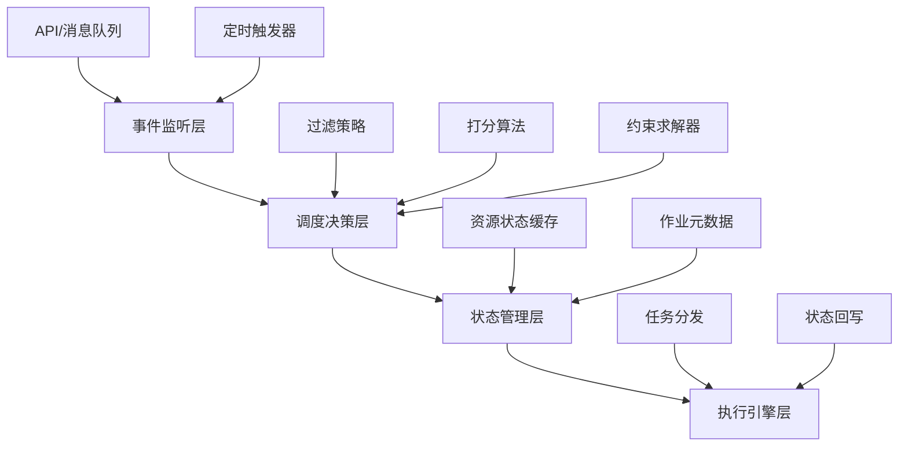
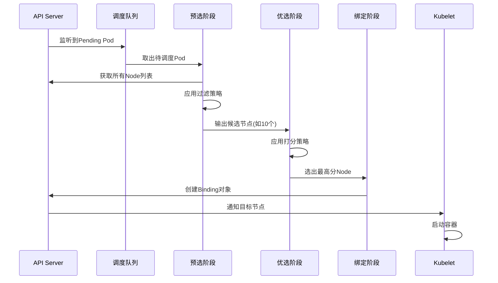
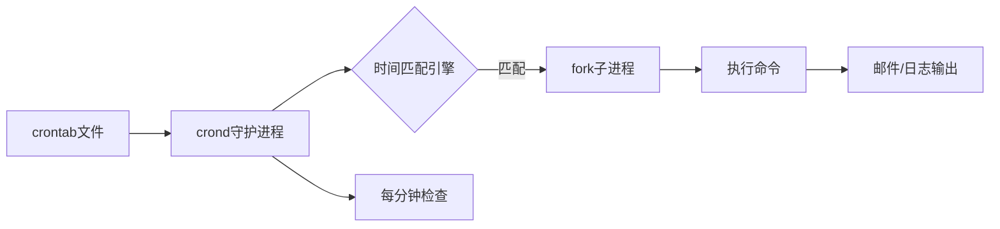
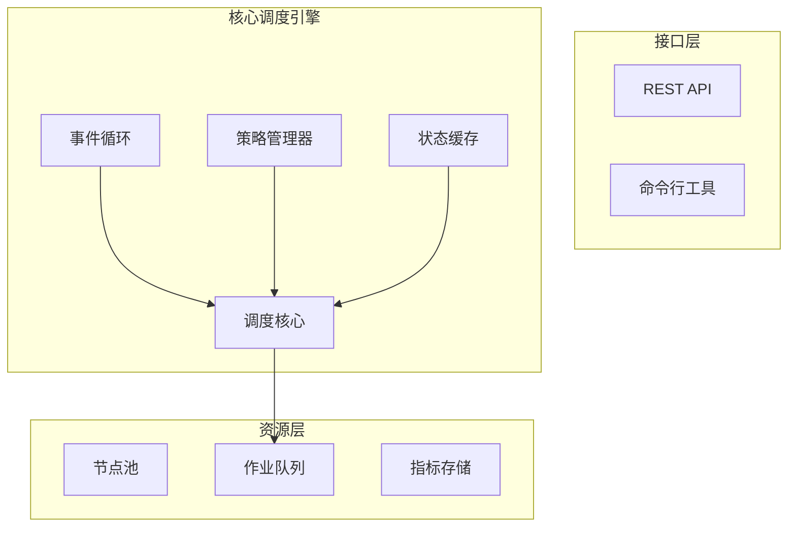

你希望深入掌握Job Scheduler（任务调度器）的设计逻辑，包括两个经典落地实现（Linux Cron Job、K8s Scheduler）的核心原理与设计思路，同时获取一套兼顾多场景、高可用、可扩展的通用Job Scheduler设计方案。下面将按照「从具体到抽象、从简单到复杂」的逻辑，层层递进展开详细讲解。

## 一、前置共识：Job Scheduler的核心三要素
无论何种任务调度器，本质都是解决三个核心问题，这是理解所有设计的基础，也是区分不同调度器的核心维度：
1.  **何时执行**：任务的触发时机（即时执行、定点定时、周期性循环、事件驱动）；
2.  **在哪执行**：任务的运行载体分配（单机进程、分布式节点、容器、云函数）；
3.  **如何执行**：任务的全生命周期管控（容错重试、日志监控、优先级、超时终止、死信处理）。

Linux Cron Job和K8s Scheduler分别对应「单机轻量定时」和「分布式容器化资源调度」的极端场景，设计思路因场景需求差异显著，却为通用设计提供了核心借鉴。

---

## 二、Linux Cron Job：单机周期性定时任务的极简实现
### 1. 核心定位与适用场景
定位：**单机、轻量、低资源消耗、高稳定的周期性定时任务调度器**，仅聚焦「按时触发本地脚本/命令」，不具备资源分配、分布式扩展和复杂容错能力。
适用场景：单机运维任务（日志切割、数据备份、定时清理、配置同步、系统监控告警），追求部署简单、维护成本低、无需复杂管控。

### 2. 核心组件与极简架构
Cron Job采用「守护进程+静态配置+简易执行引擎」的三元架构，无外部依赖，是单机调度的典范，核心组件及职责如下：

| 组件名称 | 核心作用 | 关键细节 |
|----------|----------|----------|
| `crond` 守护进程 | 调度核心，后台持续运行 | 系统启动自启（通过`systemd`/`init.d`管理），闲置时睡眠不占用CPU，每分钟精准唤醒执行一次核心调度逻辑 |
| Crontab 配置文件 | 任务元数据存储，定义「谁、何时、执行什么」 | 分两级存储，保证权限隔离与灵活性：<br>1.  用户级：`/var/spool/cron/<username>`，每个用户独立配置，通过`crontab -e`编辑，仅当前用户可执行；<br>2.  系统级：`/etc/crontab`、`/etc/cron.d/`，管理员配置，支持指定执行用户（如`root`） |
| `fork/exec` 执行引擎 | 任务实际落地执行 | 触发任务时，`crond`通过`fork`创建子进程（与主进程解耦，不阻塞后续调度），再通过`exec`加载目标脚本/命令，切换到目标用户权限执行 |
| 辅助组件（日志/权限） | 运维支撑与安全管控 | 日志：`/var/log/cron`记录任务触发、执行结果、错误信息，便于问题排查；<br>权限：`/etc/cron.allow`（白名单）/`/etc/cron.deny`（黑名单）控制用户是否可使用crontab功能 |

### 3. 核心设计思路与原理
#### （1）任务触发规则：Cron表达式（周期性定时的基石）
Cron Job的灵魂是**Cron表达式**，用简洁的字段描述周期性时间规则，也是后续众多定时调度器（如K8s CronJob、Quartz）的基础。
-  原生格式（5个字段，分钟级精度，Linux原生不支持秒/年）：`分 时 日 月 周`；
-  扩展格式（6/7个字段，主流调度框架支持）：`秒 分 时 日 月 周 [年]`；
-  特殊字符支持（实现灵活配置，覆盖绝大多数周期性场景）：
  - `*`：匹配该字段所有有效值（如「分」字段为`*`表示每分钟）；
  - `/`：指定步长（如`*/5`表示每5个单位，`0-59/10`表示每10分钟）；
  - `,`：枚举多个离散值（如`1,3,5`表示第1、3、5个单位）；
  - `-`：指定连续范围（如`1-5`表示第1到第5个单位）；
  - `?`：仅用于「日」和「周」字段，表示不关心该字段值（避免日与周冲突）；
-  经典示例：`0 3 * * 1` 表示「每周一凌晨3点整」执行，`*/10 * * * *` 表示「每10分钟」执行。

#### （2）调度核心逻辑：轮询+匹配（极简高效，无冗余）
`crond`进程的调度逻辑极其简单，这也是它高稳定、低资源消耗的核心原因，核心步骤仅5步，每分钟循环一次：
1.  **睡眠唤醒**：`crond`通过`sleep()`系统调用实现精准每分钟唤醒（对齐系统时间整分），闲置期间无CPU占用，仅消耗少量内存；
2.  **配置加载**：唤醒后加载所有有效Crontab配置（用户级+系统级），缓存到内存（避免频繁读写磁盘，提升效率）；
3.  **时间匹配**：获取当前系统时间（分、时、日、月、周），对每个任务的Cron表达式进行逐字段匹配，判断是否满足触发条件；
4.  **任务执行**：匹配成功则立即`fork`子进程，切换到目标用户（系统级配置），通过`exec`执行指定脚本/命令，主进程不等待子进程结束，立即返回继续处理下一个任务；
5.  **结果记录**：子进程执行完成后，将执行状态（成功/失败）、输出信息、执行耗时写入`/var/log/cron`日志文件，完成本次调度循环。

#### （3）优劣势总结（通用设计的优化切入点）
-  优势：**轻量无依赖、高稳定、易用性强、部署维护成本极低**，单机场景下近乎零故障，历经数十年工业验证；
-  局限性（通用设计需弥补的短板）：
  1.  仅支持单机部署，无分布式扩展能力，无法应对大规模任务和高可用需求；
  2.  无资源感知能力，不检查CPU/内存/磁盘负载，可能导致单机过载；
  3.  容错能力薄弱，任务失败无自动重试（需手动在脚本中实现重试逻辑），无死信队列和失败告警；
  4.  调度精度低，仅支持分钟级，不支持秒级/毫秒级调度；
  5.  不支持任务优先级、依赖关系和复杂任务流，无法满足业务级调度需求。

---

## 三、K8s Scheduler：分布式容器化任务的工业级资源调度
### 1. 核心定位与边界厘清
首先明确关键边界（避免混淆）：**K8s Scheduler（kube-scheduler）的核心职责是「资源分配」（解决「在哪执行」），而非「定时触发」（解决「何时执行」）**。
-  定位：**分布式、高可用、资源感知、可扩展的容器化任务（Pod）调度器**，聚焦大规模K8s集群中，将待调度Pod高效、合理地分配到最优节点；
-  定时能力来源：K8s的定时任务由`CronJob`控制器实现（复用Cron表达式），`CronJob`定时创建`Job`，`Job`创建Pod，最终由K8s Scheduler完成Pod的节点分配；
-  适用场景：云原生集群、微服务部署、大规模容器化任务，需要资源优化、负载均衡、高可用的生产环境。

### 2. 核心组件与分布式架构
K8s Scheduler是K8s核心组件之一，与集群其他组件协同工作，形成高可用分布式架构，核心组件及交互逻辑如下：

| 组件名称 | 核心作用 | 关键细节 |
|----------|----------|----------|
| `kube-scheduler` 进程 | 调度核心，决策Pod的最优节点 | 多实例部署（运行在`kube-system`命名空间），通过「领导者选举」避免单点故障，仅领导者执行调度逻辑，非领导者待命（故障时快速切换）； |
| K8s APIServer | 集群数据交互枢纽 | `kube-scheduler`通过APIServer获取「待调度Pod」「节点状态」，调度完成后通过APIServer更新Pod与节点的绑定关系，最终写入ETCD； |
| ETCD | 集群状态持久化存储 | 存储所有Pod、Node、Namespace等资源的元数据和状态，保证数据强一致性，是调度器的「数据来源」和「调度结果落地」的唯一可信源； |
| Node 节点（含`kubelet`） | 任务执行载体 | 每个节点的`kubelet`持续向APIServer上报节点状态（CPU/内存/磁盘资源、污点、标签、健康状态），接收调度结果并启动/停止/监控Pod； |
| `CronJob`/`Job` 控制器 | 定时任务触发与Pod生命周期管控 | `CronJob`：解析Cron表达式，定时创建`Job`；<br>`Job`：管控Pod的执行（一次性任务、并行度、失败重试、任务完成清理），不负责节点分配； |

### 3. 核心设计思路与原理：两阶段调度决策引擎
K8s Scheduler的核心是「**调度决策引擎**」，将「Pod分配到节点」的过程拆解为「**预选（Predicates）+ 优选（Priorities）**」两个阶段，既保证调度的「可行性」，又实现调度的「最优性」。

#### （1）前置步骤：待调度Pod筛选
`kube-scheduler`首先从APIServer获取所有「待调度Pod」（状态为`Pending`，且未指定`nodeName`），进行初步过滤：
1.  过滤掉指定自定义调度器的Pod（通过`spec.schedulerName`配置，不使用默认`kube-scheduler`）；
2.  过滤掉资源请求明显不合理的Pod（如请求CPU超过集群所有节点的最大可用CPU总量）。

#### （2）第一阶段：预选（Predicates）—— 硬约束过滤，淘汰不可行节点
核心目标：从集群所有节点中，筛选出「能够正常运行该Pod」的**可行节点集**，只要有一个条件不满足，节点直接被淘汰（无容错空间）。
预选是「硬约束」，采用「过滤式」逻辑，内置默认规则（支持插件化扩展）包括：
1.  **资源充足校验**：节点的可用CPU/内存/磁盘资源 ≥ Pod的声明请求资源（`spec.containers[*].resources.requests`）；
2.  **节点标签匹配**：Pod的`nodeSelector`/`nodeAffinity`（节点亲和性）与节点标签完全匹配；
3.  **污点与容忍匹配**：节点的「污点」（Taint，如`NoSchedule`表示不调度普通Pod、`NoExecute`表示驱逐已运行的不匹配Pod）需被Pod的「容忍」（Toleration）匹配（核心用于节点隔离、专用节点、污点驱逐）；
4.  **端口不冲突**：Pod请求的主机端口（`hostPort`）在目标节点上未被其他Pod或进程占用；
5.  **存储可用校验**：Pod请求的PVC（持久化存储）在目标节点上有对应的存储插件支持，且存储资源充足、访问权限合法；
6.  **节点健康校验**：节点处于「Ready」状态，无严重故障（如磁盘满、网络不可用、kubelet离线）。

#### （3）第二阶段：优选（Priorities）—— 软约束打分，选出最优节点
核心目标：对「可行节点集」进行量化打分（0-100分），**得分最高的节点即为最优节点**，优选是「软约束」，采用「加权求和」逻辑，允许部分规则不满足。
1.  内置打分规则（带默认权重，支持配置调整或禁用）：
    -  **资源使用率均衡**：节点的CPU/内存使用率越接近均衡（如50%），得分越高（避免节点过载或资源闲置，提升集群资源利用率）；
    -  **负载均衡**：将Pod调度到「同类型Pod数量最少」的节点，实现集群整体负载均衡，避免单点压力过大；
    -  **Pod亲和性/反亲和性**：PodAffinity（希望与某些Pod部署在同一节点/拓扑域，如微服务上下游）、PodAntiAffinity（避免与某些Pod部署在同一节点，如容灾需求），匹配度越高得分越高；
    -  **本地存储优先**：Pod使用本地存储（`emptyDir`/`hostPath`）时，本地存储充足、性能更优的节点得分更高；
2.  打分计算：最终得分 = ∑（单个规则得分 × 规则权重）；
3.  最优节点选择：选取得分最高的节点（多个节点得分相同时，随机选择其一，保证分发均匀）。

#### （4）第三阶段：绑定（Binding）—— 落地调度结果
1.  `kube-scheduler`通过APIServer发送「绑定请求」，将Pod的`spec.nodeName`设置为最优节点名称；
2.  APIServer将绑定关系写入ETCD，更新Pod和节点的状态（Pod状态仍为`Pending`，但已绑定节点）；
3.  目标节点的`kubelet`通过APIServer感知到绑定的Pod，拉取Pod配置，启动容器并监控其运行状态，完成任务落地。

#### （5）优劣势总结（通用设计的借鉴与优化方向）
-  优势：**分布式、高可用、资源感知、负载均衡、可扩展**，支持万级节点集群，历经大规模生产环境验证，适合云原生场景；
-  局限性（通用设计需弥补）：
  1.  过度依赖K8s生态，不支持非容器化任务（如本地脚本、独立Java进程、Python脚本）；
  2.  定时触发仅支持Cron表达式，不支持事件触发、依赖触发、复杂任务流等场景；
  3.  调度策略配置复杂，对非云原生运维人员不友好，缺乏可视化配置工具；
  4.  缺乏跨集群调度能力，不支持异构集群（x86+ARM、云+本地）的精细化管控。

---

## 四、通用Job Scheduler的设计思路（兼顾多场景、高可用、可扩展）
基于Linux Cron Job的「轻量易用」和K8s Scheduler的「分布式高可用、资源感知」，提炼出一套「**分层架构+可插拔组件+通用任务模型**」的通用设计方案，适配单机/分布式、容器/非容器、定时/事件触发等多场景，弥补两者的局限性。

### 1. 通用设计的核心目标
1.  通用性：支持多种任务类型、执行载体、触发方式，无需重构即可适配不同业务场景；
2.  高可用：无单点故障，任务不丢失、不重复执行，支持故障转移和容灾；
3.  高性能：支持十万级/百万级任务调度，调度延迟低（毫秒级），支持大规模任务分片；
4.  可扩展：支持自定义调度策略、执行器、存储插件，降低二次开发成本；
5.  容错性：完善的重试、死信、告警机制，支持任务全生命周期管控；
6.  可观测：完善的监控、日志、可视化面板，便于运维排查问题和性能优化。

### 2. 核心架构：5层分层解耦架构
采用「分层架构」将核心功能解耦，每层通过标准化接口交互，支持插件化扩展，避免紧耦合，提升系统的灵活性和可维护性，架构如下：
```
┌─────────────────────────────────────────────────────────┐
│ 第五层：监控与运维层（可视化、告警、日志、运维API）     │ 【可观测性与运维支撑】
├─────────────────────────────────────────────────────────┤
│ 第四层：执行层（任务执行、执行器池、容错、结果回调）   │ 【任务落地执行与管控】
├─────────────────────────────────────────────────────────┤
│ 第三层：调度核心层（定时触发、资源调度、决策引擎）     │ 【核心：解决何时/在哪执行】
├─────────────────────────────────────────────────────────┤
│ 第二层：存储层（任务持久化、集群状态、调度结果）       │ 【数据一致性与持久化保障】
└─────────────────────────────────────────────────────────┘
│ 第一层：接入层（任务接收、校验、标准化、多入口）       │ 【任务入口，解耦输入】
└─────────────────────────────────────────────────────────┘
```

#### （1）第一层：接入层（任务入口，解耦输入）
核心职责：接收各类任务请求，校验合法性，标准化格式，送入后续流程，支持多入口插件化扩展，避免单一入口瓶颈。
-  支持的接入方式（插件化，可按需扩展）：
  1.  API接口（RESTful/GRPC）：支持程序调用、自动化部署、第三方系统集成（核心入口）；
  2.  CLI命令行：支持运维人员手动提交、修改、删除任务；
  3.  静态配置：支持类似Crontab的配置文件，加载静态周期性任务，兼容传统运维习惯；
  4.  事件触发：支持监听外部事件（如文件变更、消息队列消息、数据库变更、HTTP回调）触发任务；
-  核心功能：
  1.  任务合法性校验：校验参数格式、用户权限、资源请求合理性、触发规则有效性；
  2.  任务标准化：将不同接入方式的任务转换为「通用任务模型」（见下文），统一后续流程处理格式；
  3.  异步入队：将标准化任务送入内存队列，异步提交到存储层，避免阻塞接入请求，提升吞吐量。

#### （2）第二层：存储层（数据持久化，保障一致性）
核心职责：持久化所有核心数据，保证任务不丢失、状态可追溯，支持单机/分布式部署，插件化存储选型，适配不同场景的一致性需求。
-  核心存储数据：
  1.  任务元数据：通用任务模型、触发规则、执行配置、容错配置、优先级；
  2.  集群状态：节点信息（资源、健康状态、标签、执行器状态）、调度器状态、集群拓扑；
  3.  运行数据：调度记录、执行结果、日志地址、重试记录、死信队列数据；
-  存储选型（插件化，按需适配场景）：
  1.  单机场景：SQLite、本地文件、Redis（单节点），追求轻量无依赖；
  2.  分布式场景：ETCD（强一致性、高可用，推荐）、MySQL（关系型，支持复杂查询和事务）、MongoDB（文档型，灵活扩展）；
-  关键要求：
  1.  数据持久化：任务元数据、运行数据必须持久化，避免调度器重启后任务丢失；
  2.  一致性保障：分布式场景下采用Raft/Paxos协议（ETCD）或数据库事务，避免数据不一致（如任务重复分配、状态错乱）；
  3.  缓存优化：将热点数据（待调度任务、节点状态）缓存到内存，减少存储访问开销，提升调度性能。

#### （3）第三层：调度核心层（大脑，解决「何时/在哪执行」）
这是通用Job Scheduler的核心，拆解为两个子模块，分别对应「何时执行」和「在哪执行」，均支持插件化扩展，兼顾性能与灵活性。

##### 子模块1：定时触发模块（解决「何时执行」，超越Cron的局限性）
核心职责：处理多种触发类型，精准触发任务，提升大规模任务的调度性能，避免Linux Cron Job的轮询性能瓶颈。
-  支持3种触发类型（插件化扩展，覆盖绝大多数场景）：
  1.  即时触发：任务提交后立即进入资源调度流程，无需等待；
  2.  定点定时：指定绝对时间（如`2026-01-15 10:00:00.000`）执行，精准到毫秒；
  3.  周期性触发：兼容Cron表达式（5/6/7字段），同时支持自定义周期（如每30秒、每7天、每月最后一天）；
-  核心优化：采用「**时间轮算法（Time Wheel）**」替代Cron的全量轮询，支撑百万级定时任务；
  -  原理：将时间划分为多个「槽位」，每个槽位对应一个时间片段（如1秒），任务根据触发时间放入对应槽位，调度器仅需遍历当前槽位的任务，无需遍历所有任务；
  -  优势：低CPU消耗、低调度延迟、支持大规模任务，解决Cron轮询在十万级任务下的性能瓶颈；
-  核心功能：分布式锁避免重复触发、任务暂停/恢复、触发失败重试、触发日志记录。

##### 子模块2：资源调度模块（解决「在哪执行」，借鉴K8s两阶段法并扩展）
核心职责：将任务分配到最优节点/执行器，兼顾可行性和最优性，支持单机/分布式、容器/非容器场景，插件化扩展调度规则。
-  核心流程（两阶段决策引擎，插件化扩展，兼容K8s并超越其场景限制）：
  1.  **预选（Predicates）—— 硬约束过滤**：
     -  内置默认规则：资源充足、节点健康、标签匹配、端口不冲突、存储可用；
     -  自定义规则：插件化添加（如异构架构匹配、网络带宽限制、成本管控、业务权限校验）；
     -  输出：可行节点/执行器集；
  2.  **优选（Priorities）—— 软约束打分**：
     -  内置默认规则（可配置权重）：资源使用率均衡、负载均衡、亲和性匹配、执行器性能优先、成本优先；
     -  自定义规则：插件化添加（如就近部署、业务优先级、容灾需求、历史执行成功率）；
     -  输出：得分最高的节点/执行器；
  3.  **绑定与容错**：分布式锁避免重复分配，无可行节点时支持任务排队、告警、降级到备用节点，记录绑定日志。

#### （4）第四层：执行层（任务落地，解决「如何执行」）
核心职责：执行任务，监控执行过程，处理容错，返回执行结果，支持多种执行载体插件化，兼容Linux Cron Job和K8s。
-  核心组件：
  1.  执行器池（Executor Pool）：管理执行器实例，池化复用（避免频繁创建销毁，提升性能），支持多种执行器类型（插件化扩展）：
     -  本地执行器：执行本地脚本、命令、独立进程（兼容Linux Cron Job）；
     -  容器执行器：启动Docker/K8s容器执行任务（兼容K8s）；
     -  远程执行器：通过SSH/GRPC调用远程节点执行任务；
     -  云执行器：调用云服务（如AWS Lambda、阿里云函数计算、腾讯云SCF）执行任务；
  2.  执行监控器：实时采集任务执行状态（运行中/成功/失败）、资源消耗（CPU/内存/磁盘）、执行日志、执行耗时；
  3.  容错控制器：配置化重试（次数、间隔、退避策略）、死信队列（多次失败后入队，避免无限重试，便于人工排查）、失败告警（邮件/短信/钉钉/企业微信）、任务超时终止、僵尸任务清理；
-  核心功能：任务启动、暂停、终止、重启，结果回调（通知业务系统），日志归档，执行结果持久化。

#### （5）第五层：监控与运维层（可观测性，便捷运维）
核心职责：提供调度器自身和任务执行的全量可观测性，支持便捷运维操作，降低维护成本。
-  核心功能：
  1.  监控指标：采集调度吞吐量、调度延迟、节点使用率、任务成功率、失败率、重试率等指标，对接Prometheus/Grafana，支持自定义指标扩展；
  2.  日志系统：收集调度器日志、任务执行日志、容错日志，支持查询、过滤、归档、全文检索，对接ELK Stack/ Loki；
  3.  可视化面板：任务列表、执行记录、节点状态、告警信息、资源使用率的可视化展示，支持任务的增删改查、暂停/恢复/删除；
  4.  运维工具：API/CLI支持节点注册/下线、调度策略配置更新、容错规则调整、数据备份/恢复。

### 3. 核心支撑：通用任务模型（标准化，适配多场景）
通用Job Scheduler的关键是「通用任务模型」，将所有任务标准化，适配不同接入方式和执行器，确保各层流程的统一性，核心字段如下（JSON格式示例）：
```json
{
  "jobId": "job-123456",          // 全局唯一任务ID，用于追踪和去重
  "jobName": "全量数据备份任务",   // 任务名称（便于人工识别）
  "jobType": "PERIODIC",          // 任务类型：INSTANT（即时）/TIMED（定点）/PERIODIC（周期性）
  "triggerConfig": {              // 触发配置（对应任务类型，插件化）
    "cronExpression": "0 3 * * *",// 周期性任务：Cron表达式
    "triggerTime": "2026-01-15 10:00:00.000", // 定点任务：绝对时间
    "timeZone": "Asia/Shanghai"   // 时区配置
  },
  "execConfig": {                 // 执行配置（对应执行器类型，插件化）
    "executorType": "LOCAL",      // 执行器类型：LOCAL/CONTAINER/REMOTE/CLOUD
    "executorParams": {
      "command": "/usr/bin/backup.sh",
      "args": ["--dir", "/data", "--keep", "7"],
      "timeout": 3600,            // 任务最大运行时间（秒）
      "outputPath": "/var/log/backup/" // 日志输出路径
    }
  },
  "resourceConfig": {             // 资源请求配置
    "cpuRequest": "1C",
    "memoryRequest": "2G",
    "storageRequest": "10G"
  },
  "faultToleranceConfig": {       // 容错配置
    "retryCount": 3,              // 重试次数
    "retryInterval": 60,          // 重试间隔（秒）
    "retryStrategy": "EXPONENTIAL", // 重试策略：固定间隔/指数退避
    "enableDeadLetterQueue": true // 是否启用死信队列
  },
  "priority": 8,                  // 任务优先级（1-10，越高越优先调度）
  "labels": {                     // 任务标签（用于亲和性匹配、筛选、分组）
    "env": "production",
    "business": "data-storage",
    "owner": "dev-ops"
  },
  "createTime": "2026-01-10 09:00:00",
  "updateTime": "2026-01-10 09:30:00"
}
```

### 4. 关键设计原则与最佳实践
1.  **解耦与插件化**：每层、每个核心功能均采用插件化设计，便于扩展和二次开发（如新增执行器、调度策略），降低维护成本；
2.  **高可用优先**：调度器多实例部署、领导者选举、任务持久化、执行器故障转移、数据多副本存储，避免单点故障；
3.  **性能与规模平衡**：采用时间轮、池化、缓存、异步化、任务分片等优化手段，支持大规模任务调度，兼顾低延迟和低资源消耗；
4.  **配置化优先**：核心策略（调度规则、重试策略、告警规则、资源限制）可配置，避免硬编码，适配不同业务场景的需求变化；
5.  **可观测性先行**：完善的监控、日志、告警，提前发现问题，便于问题排查和性能优化，降低运维成本；
6.  **数据一致性保障**：分布式场景下采用分布式锁、事务、Raft/Paxos协议，避免任务重复执行、状态错乱等问题。

---

## 五、总结与选型建议
### 1. 核心总结
-  **Linux Cron Job**：单机轻量定时调度，核心是「crond每分钟轮询+Cron表达式」，适合单机简单运维任务，无分布式和资源调度能力；
-  **K8s Scheduler**：分布式容器化资源调度，核心是「预选+优选」两阶段决策引擎，适合云原生大规模集群，定时能力依赖`CronJob`控制器；
-  **通用Job Scheduler**：提炼两者优势，采用「5层分层架构+可插拔组件+通用任务模型」，支持多场景、高可用、可扩展，弥补前两者的局限性，适配绝大多数业务调度需求。

### 2. 选型建议（落地参考）
-  单机简单定时运维任务：直接使用Linux Cron Job（低成本、高稳定、无学习成本）；
-  云原生容器化任务：使用K8s CronJob + K8s Scheduler（贴合云原生生态，无需重复造轮子）；
-  跨场景、复杂任务调度（混合架构、自定义策略、业务级需求）：
  1.  快速落地：使用成熟开源框架（XXL-Job、Airflow、Quartz、Prefect、Dagster）；
  2.  定制化需求：基于本文通用设计思路，构建自研调度系统，兼顾业务适配性和可扩展性。
1.  


我将从**通用设计框架**入手，深入剖析**K8s Scheduler**的架构，解析**Linux Cron**的经典实现，最后提炼可复用的设计模式。

---

## **一、通用Job Scheduler设计框架**

任何作业调度器的核心都是**资源**与**任务**的高效匹配。我将通用设计抽象为四层架构：



### **核心设计原则**

1. **关注点分离**：事件驱动、策略可插拔、状态集中管理
2. **可观测性**：调度决策可追溯，支持审计和重放
3. **容错性**：调度失败可重试，避免状态不一致
4. **扩展性**：策略通过插件注册，支持自定义逻辑

---

## **二、K8s Scheduler深度解析**

K8s Scheduler是**分布式资源调度**的典范，其设计体现了"**预选+优选**"的两阶段模型。

### **2.1 架构与工作流程**



### **2.2 核心调度阶段**

**阶段1：预选（Filtering）——硬性筛选**
- **目标**：从全量节点中快速淘汰不满足硬性条件的节点
- **关键策略**：
  - `NodeResourcesFit`：检查CPU/Memory/GPU是否充足
  - `TaintToleration`：验证节点污点与Pod容忍度匹配
  - `PodAffinityPredicate`：检查节点是否满足Pod亲和/反亲和规则
  - `NodeSelector`：匹配节点标签（如`disk-type: ssd`）

**阶段2：优选（Scoring）——精细化打分**
- **目标**：对候选节点计算优先级分数，选择最优者
- **核心算法**：
  ```
  NodeScore = Σ(策略权重 × 策略分数)
  ```
- **典型策略**：
  - `BalancedResourceAllocation`：倾向CPU/内存利用率均衡的节点，避免单资源瓶颈
  - `LeastAllocated`：优先选择资源利用率低的节点，实现负载均衡
  - `ImageLocalityPriority`：优先选择已缓存镜像的节点，加速启动

**阶段3：预留（Reserve）——资源预占**（v1.16+引入）
- 将Pod资源需求"预占"到目标节点，防止并发调度冲突
- 若后续绑定失败，自动释放预留资源

**阶段4：绑定（Bind）——提交决策**
- 向API Server发送Binding对象，将Pod与Node绑定
- Kubelet监听到绑定事件后启动容器

### **2.3 高级特性**

**调度框架（Scheduling Framework）**：
- 在预选/优选前后提供多个**扩展点**（PreFilter、PostBind等）
- 允许注入自定义逻辑，如审计日志、资源预留

**抢占调度（Preemption）**：
- 高优先级Pod无法调度时，驱逐低优先级Pod
- 策略：选择牺牲品 → 优雅终止（30秒）→ 调度高优先级Pod

**性能优化**：
- **本地缓存**：缓存节点和Pod状态，减少对API Server的调用
- **并行调度**：支持同时处理多个Pod
- **优先级队列**：按优先级处理不同重要性的Pod

---

## **三、Linux Cron Job设计原理**

Linux cron是**时间驱动调度**的经典实现，已稳定运行数十年。其核心是`crond`守护进程。

### **3.1 架构设计**



### **3.2 核心机制**

**时间匹配算法**
- **Cron表达式**：`分 时 日 月 周` 五个字段，支持`*`、`,`、`-`、`/`等操作符
- **匹配逻辑**：每分钟唤醒一次，遍历所有crontab任务，检查当前时间是否匹配表达式
- **高效实现**：使用位掩码存储时间字段，将匹配复杂度降至O(1)

**执行流程**
1. **加载配置**：启动时读取`/etc/crontab`、`/etc/cron.d/`及用户crontab文件
2. **定期检查**：每分钟检查一次，精确到秒级唤醒
3. **任务派生**：匹配的任务通过`fork()`创建子进程，在子进程中执行命令
4. **输出处理**：标准输出/错误通过邮件发送给任务所有者，或重定向到日志

**关键设计特点**
- **极简性**：仅259行核心代码（Vixie Cron实现）
- **无状态**：不维护任务执行历史，每次调度独立
- **权限隔离**：通过setuid/setgid切换用户身份执行
- **环境隔离**：每次执行新建进程，环境干净

---

## **四、两种调度器的对比与启示**

| 维度 | K8s Scheduler | Linux Cron |
|------|---------------|------------|
| **调度触发** | **事件驱动**（Pod创建） | **时间驱动**（每分钟检查） |
| **决策复杂度** | 多阶段（预选+优选） | 无决策（时间匹配） |
| **资源感知** | 全局资源视图，动态更新 | 无资源感知 |
| **容错机制** | 预留、抢占、重试 | 简单重试（失败邮件通知） |
| **扩展性** | 插件框架，高度可定制 | 固定表达式，不可扩展 |
| **适用场景** | 分布式资源调度 | 单机定时任务 |

### **从中学到的通用设计模式**

1. **两阶段筛选模式**：K8s的"预选+优选"可应用于任何资源匹配场景。先快速过滤，再精细化评估。

2. **事件驱动架构**：通过监听API Server事件而非轮询，大幅降低系统负载。通用设计中可采用消息队列（Kafka）或Watch机制。

3. **策略插件化**：将调度策略抽象为接口，支持热插拔。K8s的Scheduling Framework是绝佳参考。

4. **状态缓存**：K8s的本地缓存设计减少了90%以上的API Server调用。任何调度器都应维护轻量级状态副本来提升性能。

5. **时间轮算法**（适用于Cron类调度）：将任务按时间分桶，实现O(1)的调度触发，避免每分钟全量扫描。

---

## **五、设计一个通用Job Scheduler的实战指南**

### **5.1 分层架构设计**



### **5.2 关键组件实现要点**

**1. 事件循环（Event Loop）**
- 使用**优先队列**存储待调度任务，支持优先级抢占
- 结合**时间轮**处理延迟调度任务
- 批量处理：每轮调度处理N个任务，避免单任务阻塞

**2. 策略管理器（Strategy Manager）**
- 定义策略接口：`Filter(nodes, job) → nodes`, `Score(node, job) → float64`
- 支持权重配置：允许用户调整不同策略的重要性
- 策略链模式：按顺序执行策略，支持短路返回

**3. 状态缓存（State Cache）**
- 采用**最终一致性**模型：接受短暂不一致，换取性能
- 增量更新：只接收变化事件，而非全量同步
- TTL机制：过期数据自动失效

**4. 调度核心（Scheduler Core）**
```python
def schedule(job):
    # 阶段1: 预选
    candidates = [n for n in nodes if all(f.filter(n, job) for f in filters)]
    if not candidates:
        return SCHEDULE_FAILED
    
    # 阶段2: 优选
    scores = {n: sum(s.score(n, job) * s.weight for s in scorers) 
              for n in candidates}
    best_node = max(scores, key=scores.get)
    
    # 阶段3: 预留（可选）
    if not reserve(best_node, job):
        return SCHEDULE_RETRY
    
    # 阶段4: 绑定
    bind(best_node, job)
    return SCHEDULE_SUCCESS
```

### **5.3 性能优化 checklist**

- [ ] **缓存命中率 > 95%**：减少对后端存储的查询
- [ ] **调度延迟 < 100ms**：P99延迟控制在百毫秒内
- [ ] **并发调度支持**：根据CPU核数调整worker线程数
- [ ] **反压机制**：当队列积压时，拒绝新任务或触发告警

### **5.4 避坑指南**

1. **避免过度设计**：Linux Cron的简洁性值得学习，只有K8s级别的复杂度才需要多阶段调度
2. **状态一致性陷阱**：调度决策后、执行前，资源状态可能变化。必须引入预留机制或事务性绑定
3. **策略爆炸**：限制内置策略数量，优先支持自定义插件
4. **时间精度误区**：Cron的分钟级精度已满足90%场景，毫秒级调度需考虑时间同步问题

---

**总结**：K8s Scheduler代表了**资源感知的智能调度**巅峰，而Linux Cron是**时间驱动调度**的极简典范。设计通用调度器时，应根据场景选择架构——**分布式资源调度**参考K8s的两阶段模型，**定时任务调度**优先采用时间轮算法。最核心的思想是：**先过滤，再打分；先正确，再优化**。


我将详细介绍如何设计一个通用的作业调度系统，并深入分析K8s Scheduler和Linux Cron的设计原理。

## 一、作业调度系统核心设计要素

### 1.1 关键组件
```
┌─────────────────────────────────────────────────────────────┐
│                     作业调度系统架构                          │
├─────────────┬──────────────┬──────────────┬─────────────────┤
│ 调度器       │ 作业存储     │ 执行器       │ 监控与告警       │
├─────────────┼──────────────┼──────────────┼─────────────────┤
│• 调度决策    │• 作业定义    │• 任务执行    │• 状态监控       │
│• 资源分配   │• 状态持久化  │• 资源隔离    │• 性能指标       │
│• 优先级管理 │• 依赖管理    │• 重试机制    │• 告警通知       │
│• 负载均衡   │• 版本控制    │• 日志收集    │• 故障恢复       │
└─────────────┴──────────────┴──────────────┴─────────────────┘
```

### 1.2 调度策略分类
```python
class SchedulingPolicy:
    """调度策略基类"""
    def schedule(self, job: Job, resources: List[Resource]) -> Optional[Resource]:
        pass

# 1. 基于时间的调度
class TimeBasedScheduler(SchedulingPolicy):
    """定时调度（如cron）"""
    
# 2. 基于依赖的调度
class DependencyScheduler(SchedulingPolicy):
    """DAG依赖调度"""
    
# 3. 基于资源的调度
class ResourceBasedScheduler(SchedulingPolicy):
    """资源感知调度（如K8s）"""
    
# 4. 基于优先级的调度
class PriorityScheduler(SchedulingPolicy):
    """优先级队列调度"""
    
# 5. 基于批处理的调度
class BatchScheduler(SchedulingPolicy):
    """批处理调度（如Slurm）"""
```

## 二、Kubernetes Scheduler 深度解析

### 2.1 架构设计
```
┌─────────────────────────────────────────────────────────────┐
│                    Kubernetes Scheduler                       │
├─────────────┬───────────────────────────────────────────────┤
│  调度周期     │ 1. 监听Pod队列                               │
│             │ 2. 过滤节点（Predicate）                      │
│             │ 3. 打分节点（Priority）                       │
│             │ 4. 绑定节点（Bind）                           │
├─────────────┼───────────────────────────────────────────────┤
│  核心组件     │ • scheduler-plugins：扩展框架               │
│             │ • kube-scheduler：主调度器                   │
│             │ • scheduler-framework：调度框架              │
└─────────────┴───────────────────────────────────────────────┘
```

### 2.2 调度算法原理

```go
// 简化版调度流程
func schedulePod(pod *v1.Pod, nodes []*v1.Node) *v1.Node {
    // 阶段1：过滤（Predicates）
    feasibleNodes := filterNodes(pod, nodes)
    
    // 阶段2：打分（Priorities）
    scores := prioritizeNodes(pod, feasibleNodes)
    
    // 阶段3：选择
    return selectHost(scores)
}

// 过滤策略示例
type PredicatePolicy struct {
    Name           string
    PredicateFunc  PredicateFunc
}

// 常见的Predicate函数
var predicates = []PredicatePolicy{
    {"PodFitsResources", checkNodeResource},      // 资源检查
    {"NodeSelector", checkNodeSelector},          // 节点选择器
    {"PodFitsHostPorts", checkHostPorts},        // 端口检查
    {"NoDiskConflict", checkDiskConflict},       // 磁盘检查
}

// 打分策略示例
type PriorityConfig struct {
    Name   string
    Weight int
    Map    PriorityMapFunction
    Reduce PriorityReduceFunction
}

// 常见的Priority函数
var priorities = []PriorityConfig{
    {"LeastRequestedPriority", 1, calculateLeastRequested, nil},
    {"BalancedResourceAllocation", 1, calculateBalancedResource, nil},
    {"NodeAffinityPriority", 1, calculateNodeAffinity, nil},
}
```

### 2.3 调度器扩展机制

```go
// 调度框架插件接口
type Framework interface {
    // 调度周期扩展点
    PreFilter(PluginContext, *v1.Pod) *Status
    Filter(PluginContext, *v1.Pod, NodeInfo) *Status
    PostFilter(PluginContext, *v1.Pod, map[string]*Status) *Status
    PreScore(PluginContext, *v1.Pod, []*v1.Node) *Status
    Score(PluginContext, *v1.Pod, string) (int64, *Status)
    NormalizeScore(PluginContext, *v1.Pod, map[string]int64) *Status
    Reserve(PluginContext, *v1.Pod, string) *Status
    PreBind(PluginContext, *v1.Pod, string) *Status
    Bind(PluginContext, *v1.Pod, string) *Status
    PostBind(PluginContext, *v1.Pod, string) *Status
}
```

### 2.4 高级调度特性

1. **亲和性/反亲和性**（Affinity/Anti-affinity）
2. **污点和容忍度**（Taints and Tolerations）
3. **拓扑分布约束**（Topology Spread Constraints）
4. **抢占式调度**（Preemption）
5. **多调度器**（Multiple Schedulers）

## 三、Linux Cron Job 设计原理

### 3.1 核心设计
```c
// crond守护进程主要结构
struct cron_daemon {
    time_t last_minute;          // 上次检查时间
    struct passwd *pw;           // 用户信息
    char **envp;                 // 环境变量
    struct cron_db database;     // 作业数据库
};

// crontab条目结构
struct cron_entry {
    int minute[60];              // 分钟位图
    int hour[24];                // 小时位图
    int dom[32];                 // 日位图
    int month[12];               // 月位图
    int dow[7];                  // 星期位图
    char *cmd;                   // 命令
    pid_t pid;                   // 进程ID
    struct cron_entry *next;
};
```

### 3.2 调度算法
```python
class CronScheduler:
    def __init__(self):
        self.jobs = []
        self.running_jobs = {}
        
    def check_and_run(self):
        """每分钟检查一次"""
        now = datetime.now()
        
        for job in self.jobs:
            if self.should_run(job, now):
                self.run_job(job)
                
    def should_run(self, job, now):
        """检查是否应该运行作业"""
        return (job.minute_match(now.minute) and
                job.hour_match(now.hour) and
                job.day_match(now.day) and
                job.month_match(now.month) and
                job.weekday_match(now.weekday()))
    
    def run_job(self, job):
        """运行作业"""
        pid = os.fork()
        if pid == 0:  # 子进程
            # 设置环境变量
            os.environ.update(job.env)
            # 执行命令
            os.execvp(job.command[0], job.command)
        else:  # 父进程
            self.running_jobs[pid] = job
```

### 3.3 时间表达式解析
```
# cron时间表达式语法
*    *    *    *    *    command
-    -    -    -    -
|    |    |    |    |
|    |    |    |    +----- 星期 (0 - 7) (星期天=0或7)
|    |    |    +---------- 月 (1 - 12)
|    |    +--------------- 日 (1 - 31)
|    +-------------------- 时 (0 - 23)
+------------------------- 分 (0 - 59)

# 特殊字符
*    任何值
,    值列表分隔符
-    范围
/    步长
```

## 四、通用作业调度系统设计

### 4.1 系统架构
```
┌─────────────────────────────────────────────────────────────┐
│                   通用作业调度系统架构                        │
├─────────────────────────────────────────────────────────────┤
│                        API Gateway                           │
├──────────────┬──────────────┬──────────────┬────────────────┤
│  Web UI      │  CLI工具     │  SDK         │   Webhook      │
├──────────────┴──────────────┴──────────────┴────────────────┤
│                    核心调度引擎                                │
├──────────────┬──────────────┬──────────────┬────────────────┤
│ 调度器集群    │ 状态管理器    │ 事件总线      │ 插件管理器      │
├──────────────┼──────────────┼──────────────┼────────────────┤
│ 作业定义      │ 作业队列      │ 执行器池      │ 资源管理器      │
├──────────────┼──────────────┼──────────────┼────────────────┤
│ 元数据存储    │ 作业存储      │ 日志存储      │ 指标存储        │
│  (PostgreSQL)│  (Redis)     │  (Elastic)   │  (Prometheus)  │
└──────────────┴──────────────┴──────────────┴────────────────┘
```

### 4.2 核心接口设计

```python
from abc import ABC, abstractmethod
from enum import Enum
from typing import List, Dict, Optional, Any
from datetime import datetime
from dataclasses import dataclass, field

class JobStatus(Enum):
    PENDING = "pending"
    SCHEDULED = "scheduled"
    RUNNING = "running"
    SUCCEEDED = "succeeded"
    FAILED = "failed"
    CANCELLED = "cancelled"
    RETRYING = "retrying"

@dataclass
class Job:
    """作业定义"""
    id: str
    name: str
    type: str  # "shell", "http", "k8s", "docker", "spark", etc.
    
    # 调度配置
    schedule: Optional[str] = None  # cron表达式
    timezone: str = "UTC"
    start_time: Optional[datetime] = None
    end_time: Optional[datetime] = None
    max_runtime: int = 3600  # 秒
    
    # 执行配置
    command: Optional[str] = None
    args: List[str] = field(default_factory=list)
    env: Dict[str, str] = field(default_factory=dict)
    working_dir: Optional[str] = None
    
    # 资源需求
    resources: Dict[str, Any] = field(default_factory=dict)
    
    # 依赖关系
    dependencies: List[str] = field(default_factory=list)  # 作业ID列表
    dag_config: Optional[Dict] = None  # DAG配置
    
    # 重试策略
    retry_policy: Dict[str, Any] = field(default_factory=dict)
    
    # 优先级
    priority: int = 0
    
    # 元数据
    labels: Dict[str, str] = field(default_factory=dict)
    annotations: Dict[str, str] = field(default_factory=dict)

class Scheduler(ABC):
    """调度器抽象接口"""
    
    @abstractmethod
    def schedule(self, job: Job) -> str:
        """调度作业，返回作业ID"""
        pass
    
    @abstractmethod
    def unschedule(self, job_id: str) -> bool:
        """取消调度"""
        pass
    
    @abstractmethod
    def pause(self, job_id: str) -> bool:
        """暂停作业"""
        pass
    
    @abstractmethod
    def resume(self, job_id: str) -> bool:
        """恢复作业"""
        pass
    
    @abstractmethod
    def status(self, job_id: str) -> JobStatus:
        """获取作业状态"""
        pass

class Executor(ABC):
    """执行器抽象接口"""
    
    @abstractmethod
    def execute(self, job: Job) -> Dict[str, Any]:
        """执行作业"""
        pass
    
    @abstractmethod
    def cancel(self, execution_id: str) -> bool:
        """取消执行"""
        pass
    
    @abstractmethod
    def logs(self, execution_id: str, tail: int = 100) -> List[str]:
        """获取日志"""
        pass
```

### 4.3 调度引擎实现

```python
class GenericJobScheduler(Scheduler):
    """通用作业调度器"""
    
    def __init__(self, config: Dict[str, Any]):
        self.config = config
        self.job_store = self._init_job_store()
        self.executor_pool = self._init_executor_pool()
        self.scheduler_engine = self._init_scheduler_engine()
        self.event_bus = self._init_event_bus()
        self.metrics = self._init_metrics()
        
    def _init_scheduler_engine(self):
        """初始化调度引擎"""
        return SchedulerEngine(
            time_based_scheduler=TimeBasedScheduler(),
            resource_based_scheduler=ResourceBasedScheduler(),
            dependency_scheduler=DependencyScheduler(),
            priority_scheduler=PriorityScheduler()
        )
    
    def schedule(self, job: Job) -> str:
        """调度作业的核心逻辑"""
        
        # 1. 验证作业
        self._validate_job(job)
        
        # 2. 持久化作业
        job_id = self.job_store.save(job)
        
        # 3. 触发调度事件
        self.event_bus.publish(
            "job.scheduled",
            {"job_id": job_id, "job": job}
        )
        
        # 4. 如果是定时作业，添加到定时调度器
        if job.schedule:
            self.scheduler_engine.add_scheduled_job(job_id, job)
        
        # 5. 如果是立即执行作业，加入执行队列
        elif not job.schedule:
            self._enqueue_for_execution(job_id, job)
        
        return job_id
    
    def _enqueue_for_execution(self, job_id: str, job: Job):
        """将作业加入执行队列"""
        
        # 检查依赖
        if job.dependencies:
            if not self._check_dependencies(job):
                # 依赖未满足，等待依赖完成
                self.job_store.update_status(job_id, JobStatus.PENDING)
                return
        
        # 选择执行器
        executor = self._select_executor(job)
        
        # 分配资源
        if not self._allocate_resources(job, executor):
            # 资源不足，等待重试
            self.job_store.update_status(job_id, JobStatus.PENDING)
            self._requeue_job(job_id, job)
            return
        
        # 提交执行
        execution_id = executor.execute(job)
        
        # 更新状态
        self.job_store.update_status(job_id, JobStatus.RUNNING)
        self.job_store.set_execution_id(job_id, execution_id)
    
    def _select_executor(self, job: Job) -> Executor:
        """基于负载均衡和资源需求选择执行器"""
        
        executors = self.executor_pool.get_available_executors()
        
        # 根据作业类型过滤
        suitable_executors = [
            e for e in executors 
            if e.supports_job_type(job.type)
        ]
        
        if not suitable_executors:
            raise NoSuitableExecutorError(f"No executor supports job type: {job.type}")
        
        # 打分算法
        scores = []
        for executor in suitable_executors:
            score = self._score_executor(executor, job)
            scores.append((executor, score))
        
        # 选择最高分的执行器
        scores.sort(key=lambda x: x[1], reverse=True)
        return scores[0][0]
    
    def _score_executor(self, executor: Executor, job: Job) -> float:
        """为执行器打分"""
        score = 0.0
        
        # 1. 资源匹配度（30%）
        resource_score = self._calculate_resource_match(executor, job)
        score += resource_score * 0.3
        
        # 2. 负载情况（30%）
        load_score = self._calculate_load_score(executor)
        score += load_score * 0.3
        
        # 3. 亲和性/反亲和性（20%）
        affinity_score = self._calculate_affinity_score(executor, job)
        score += affinity_score * 0.2
        
        # 4. 历史成功率（20%）
        success_score = self._calculate_success_score(executor)
        score += success_score * 0.2
        
        return score
```

### 4.4 DAG调度器实现

```python
class DAGScheduler:
    """DAG（有向无环图）调度器"""
    
    def __init__(self):
        self.graph = nx.DiGraph()
        self.job_dependencies = {}
        
    def add_job(self, job: Job):
        """添加作业到DAG"""
        self.graph.add_node(job.id, job=job)
        
        # 添加依赖边
        for dep_id in job.dependencies:
            self.graph.add_edge(dep_id, job.id)
        
        # 检查是否有环
        if not nx.is_directed_acyclic_graph(self.graph):
            raise CyclicDependencyError("Dependency graph contains cycles")
    
    def get_execution_order(self) -> List[List[str]]:
        """获取拓扑排序的执行顺序（支持并行执行）"""
        
        if not self.graph:
            return []
        
        # 获取拓扑排序
        sorted_nodes = list(nx.topological_sort(self.graph))
        
        # 按层级分组（同一层级的作业可以并行执行）
        levels = {}
        for node in sorted_nodes:
            # 计算节点的最长路径长度作为层级
            if self.graph.in_degree(node) == 0:
                levels[node] = 0
            else:
                predecessors = list(self.graph.predecessors(node))
                level = max(levels[p] for p in predecessors) + 1
                levels[node] = level
        
        # 按层级分组
        grouped = {}
        for node, level in levels.items():
            grouped.setdefault(level, []).append(node)
        
        # 返回层级列表
        return [grouped[level] for level in sorted(grouped.keys())]
    
    def on_job_complete(self, job_id: str, status: JobStatus):
        """作业完成时的回调"""
        
        # 更新作业状态
        self.graph.nodes[job_id]['status'] = status
        
        # 触发后续作业
        successors = list(self.graph.successors(job_id))
        
        for succ_id in successors:
            # 检查所有前置作业是否都已完成
            predecessors = list(self.graph.predecessors(succ_id))
            all_done = all(
                self.graph.nodes[pred_id].get('status') == JobStatus.SUCCEEDED
                for pred_id in predecessors
            )
            
            if all_done:
                # 触发后续作业执行
                self._trigger_job(succ_id)
```

### 4.5 高可用设计

```python
class HighAvailabilityScheduler:
    """高可用调度器"""
    
    def __init__(self, config: Dict[str, Any]):
        self.config = config
        self.leader_election = LeaderElection()
        self.cluster_manager = ClusterManager()
        self.state_synchronizer = StateSynchronizer()
        
    def run(self):
        """运行调度器"""
        
        # 1. 加入集群
        self.cluster_manager.join_cluster()
        
        # 2. 参与leader选举
        while True:
            if self.leader_election.is_leader():
                self._run_as_leader()
            else:
                self._run_as_follower()
                
            time.sleep(1)
    
    def _run_as_leader(self):
        """作为leader运行"""
        
        # 从共享存储同步状态
        state = self.state_synchronizer.sync_state()
        
        # 执行调度决策
        jobs_to_schedule = self._get_pending_jobs(state)
        
        for job in jobs_to_schedule:
            # 分布式锁防止重复调度
            with distributed_lock(f"job:{job.id}"):
                if not self._is_already_scheduled(job.id):
                    self._schedule_job(job)
        
        # 发布心跳
        self.leader_election.send_heartbeat()
    
    def _run_as_follower(self):
        """作为follower运行"""
        
        # 监控leader状态
        if not self.leader_election.is_leader_alive():
            # 尝试成为leader
            self.leader_election.campaign()
        
        # 执行本地任务（如日志收集、监控等）
        self._run_background_tasks()
```

### 4.6 监控和指标

```python
class MetricsCollector:
    """指标收集器"""
    
    def __init__(self):
        self.metrics = {
            'scheduler': {
                'jobs_total': Counter('scheduler_jobs_total', 'Total jobs'),
                'jobs_running': Gauge('scheduler_jobs_running', 'Running jobs'),
                'jobs_failed': Counter('scheduler_jobs_failed', 'Failed jobs'),
                'scheduling_duration': Histogram('scheduling_duration', 'Scheduling duration'),
            },
            'executor': {
                'queue_size': Gauge('executor_queue_size', 'Queue size'),
                'execution_time': Histogram('execution_time', 'Execution time'),
                'resource_usage': Gauge('resource_usage', 'Resource usage'),
            }
        }
    
    def record_scheduling(self, job_id: str, duration: float):
        """记录调度指标"""
        self.metrics['scheduler']['scheduling_duration'].observe(duration)
        self.metrics['scheduler']['jobs_total'].inc()
    
    def record_execution(self, job_id: str, duration: float, status: str):
        """记录执行指标"""
        self.metrics['executor']['execution_time'].observe(duration)
        
        if status == 'failed':
            self.metrics['scheduler']['jobs_failed'].inc()
```

## 五、设计原则和最佳实践

### 5.1 核心设计原则

1. **松耦合设计**
   - 调度器、执行器、存储分离
   - 插件化架构，易于扩展

2. **最终一致性**
   - 事件驱动架构
   - 状态异步同步

3. **可观测性**
   - 完整的指标、日志、链路追踪
   - 实时监控和告警

4. **容错性**
   - 作业重试机制
   - 失败转移（Failover）
   - 优雅降级

5. **可扩展性**
   - 水平扩展架构
   - 无状态设计（状态外部化）

### 5.2 性能优化策略

```python
class PerformanceOptimizer:
    """性能优化器"""
    
    @staticmethod
    def optimize_scheduling():
        """调度优化策略"""
        
        strategies = [
            # 1. 批量调度
            BatchSchedulingStrategy(batch_size=100),
            
            # 2. 延迟调度
            DelayedSchedulingStrategy(delay_ms=50),
            
            # 3. 缓存优化
            CachingStrategy(cache_ttl=300),
            
            # 4. 预取策略
            PrefetchStrategy(prefetch_count=10),
            
            # 5. 负载均衡
            LoadBalancingStrategy(algorithm="least_connections"),
        ]
        
        return CompositeStrategy(strategies)
```

### 5.3 安全设计

1. **认证和授权**
   - OAuth2/OpenID Connect
   - RBAC权限控制
   - 作业级权限隔离

2. **数据安全**
   - 敏感信息加密存储
   - 传输层加密（TLS）
   - 审计日志

3. **资源隔离**
   - 命名空间隔离
   - 资源配额限制
   - 安全沙箱

## 六、现代调度系统趋势

### 6.1 云原生调度
- 容器化部署
- 服务网格集成
- 自动扩缩容

### 6.2 智能调度
- 机器学习预测资源需求
- 自适应调度策略
- 成本优化调度

### 6.3 多集群/混合云调度
- 跨集群作业调度
- 多云资源管理
- 边缘计算集成

## 总结

设计一个通用的作业调度系统需要综合考虑：

1. **架构设计**：模块化、可扩展、高可用
2. **调度算法**：多种策略组合，支持插件扩展
3. **资源管理**：智能分配、负载均衡、成本优化
4. **可靠性**：容错、重试、监控、告警
5. **用户体验**：易用API、丰富UI、详细文档

一个优秀的调度系统应该像K8s Scheduler一样强大而灵活，像Cron一样简单易用，同时具备现代云原生系统的所有特性。通过抽象通用接口、插件化架构和智能调度算法，可以构建出适应各种场景的通用调度平台。


一、什么是 Job Scheduler：当代码需要“闹钟”
简单来说，Job Scheduler（任务调度器）就是为代码或程序配置的“闹钟”。我们不再需要手动触发某个脚本或命令，而是预先设定好规则，调度器会像一位不知疲倦的管家，在指定的时间或条件下，自动执行这些任务。
它的核心职责是回答两个问题：“何时执行？” 与 “在哪执行？”。根据对这两个问题的不同侧重，调度器可以分为两大类：
- 时间触发调度 (Time-based Scheduling)：更关心“何时执行”。这类调度器专注于根据预设的时间点（如每天凌晨 2 点）、时间间隔（如每 5 分钟）或日历规则来触发任务。Linux Cron 是其最经典的代表。
- 资源调度 (Resource-based Scheduling)：更关心“在哪执行”。这类调度器负责在资源池（如服务器集群）中，为任务（如一个容器或应用实例）寻找最合适的“家”。它需要综合考虑节点的 CPU、内存、存储、网络以及各种复杂的策略（如亲和性、污点），来做出最优决策。Kubernetes Scheduler 是该领域的典范。
此外，根据部署规模，调度器也分为单机调度器（如 Cron）和分布式调度器。我们后续将要设计的通用方案，就属于分布式时间触发调度器的范G畴。
在深入设计之前，理解以下几个通用概念至关重要，它们是衡量任何一个调度系统成熟度的关键标尺：
1. 一致性语义 (Consistency Semantics)
调度系统对任务执行的承诺是什么？
- At-least-once (至少一次)：这是最常见和实用的模型。系统保证任务至少会被成功执行一次。在网络分区、节点故障等异常情况下，任务可能会被重复执行。因此，它强烈依赖任务自身的幂等性来保证最终结果的正确性。
- Exactly-once (精确一次)：最严格的模型，保证任务在任何情况下都不多不少，只被成功执行一次。这在技术上实现成本极高，通常需要分布式事务、状态快照和原子提交等复杂机制的配合。对于绝大多数业务场景，追求绝对的“精确一次”性价比很低。
2. 幂等性 (Idempotency)
幂等性是指一个操作无论执行一次还是多次，其产生的影响和结果都是相同的。它是实现 At-least-once 语义的基石。
示例：一个“创建订单”的任务，如果简单地执行数据库 INSERT，重复执行就会创建多笔相同订单。但如果引入一个唯一的“订单请求 ID”，在执行 INSERT 前先检查该 ID 是否已存在，任务就变得幂等了。
3. 重试与补偿 (Retry & Compensation)
- 重试 (Retry)：当任务执行失败时（如网络超时、依赖服务不可用），调度系统应具备自动重试的能力。简单的立即重试可能会加剧下游系统压力，因此通常会采用指数退避（Exponential Backoff）等策略，逐步拉长重试间隔。
- 补偿 (Compensation)：当一个由多个步骤组成的业务流程失败时，仅仅重试失败的步骤可能不够。补偿是指执行一个“反向操作”，以撤销已经成功完成的步骤，使系统状态回滚。例如，订单创建成功但支付失败，补偿操作可能就是“取消订单”。

---
二、Linux Cron 设计思路与原理：简单即是力量
cron 是 Unix/Linux 系统中一个历久弥坚的工具，自 1975 年诞生以来，其核心设计几乎未变。它完美诠释了 Unix “做一件事并把它做好”的设计哲学。cron 是一个典型的、单机的、基于时间的调度器。
1. 组件角色与核心工作流
cron 的世界主要由以下几个部分构成：
- crond 守护进程：cron 的心脏。这个后台进程在系统启动时运行，是所有定时任务的执行者。
- 用户 Crontab：每个用户都可以拥有自己的 crontab 文件，通过 crontab -e 命令编辑。这些文件通常存储在 /var/spool/cron/ 目录下（如 /var/spool/cron/zhaojieyi），并且只有文件所有者和 root 用户可以读写。
- 系统 Crontab：
  - /etc/crontab：系统级别的主 crontab 文件。与用户 crontab 不同，它需要额外指定执行任务的用户名。
  - /etc/cron.d/：这是一个目录，允许系统服务或应用程序（如 yum）放置自己的 crontab 配置文件，而无需修改主配置文件，便于包管理。
  - /etc/cron.hourly, /etc/cron.daily, /etc/cron.weekly, /etc/cron.monthly：这些目录下的可执行脚本会被 /etc/crontab 中预设的规则（通常由 run-parts 命令执行）分别按小时、天、周、月触发。
- MAILTO 环境变量：如果在 crontab 文件中设置了 MAILTO=your.email@example.com，那么任务执行的任何输出（STDOUT 或 STDERR）都会被作为邮件发送到指定邮箱。如果 MAILTO 为空（MAILTO=""），则不发送邮件。这是 cron 最原始的可观察性机制。
- 日志：crond 的活动（如任务的开始与结束）通常被记录到系统日志中，如 /var/log/cron 或 /var/log/syslog，具体位置取决于系统发行版。
2. 触发模型：分钟级的轮询
cron 的工作模式极其简单直接：
1. 分钟轮询：crond 守护进程每分钟醒来一次。
2. 解析与比对：它会检查所有 crontab 文件（包括 /etc/crontab, /etc/cron.d/* 以及 /var/spool/cron/*）中记录的每一个任务。
3. 计算匹配：对于每个任务，它会将其 cron 表达式与当前的系统时间（分钟、小时、日、月、周）进行匹配。
4. 执行任务：如果匹配成功，crond 会在一个新的 shell 环境中执行该任务指定的命令。
Cron 表达式格式：
# ┌───────────── 分钟 (0 - 59)
# │ ┌───────────── 小时 (0 - 23)
# │ │ ┌───────────── 日 (1 - 31)
# │ │ │ ┌───────────── 月 (1 - 12)
# │ │ │ │ ┌───────────── 周 (0 - 6) (周日可用 0 或 7)
# │ │ │ │ │
# │ │ │ │ │
# * * * * * <要执行的命令>

示例：30 4 * * 1 /usr/bin/backup.sh 表示在每周一的凌晨 4:30 执行备份脚本。
3. 关键设计与权衡
Misfire (错过触发) 行为
如果任务预定执行时，机器处于关机状态，会发生什么？标准的 crond 不会做任何事。它不会在系统重启后“补偿”执行错过的任务。因为它的设计模型非常简单：只关心“当前这一分钟”应该做什么。
为了解决这个问题，anacron 工具应运而生。它通常用于桌面或笔记本电脑，这些设备不会 24/7 运行。anacron 会记录任务的最后一次执行时间戳，并在系统启动时检查是否有任务错过了执行周期（如“天”、“周”），如果有，则立即执行它。
现代 Linux 系统中，systemd Timers 提供了比 cron 和 anacron 更强大和灵活的功能，例如秒级精度、更丰富的依赖关系、更好的日志集成以及处理错过任务的策略（通过 Persistent=true）。
时区与夏令时（DST）
这是一个 cron 著名的“坑”。crond 使用其所在操作系统的系统时区来解释 crontab 中的时间。这在夏令时（DST）切换时会导致问题：
- 时钟向前拨快一小时（例如，从 02:00 变为 03:00）：如果你的任务恰好定在 02:30 执行，那么这一天它将不会被执行，因为 02:30 这个时间点“消失”了。
- 时钟向后拨慢一小时（例如，从 02:00 回到 01:00）：如果你的任务定在 01:30 执行，它可能会被执行两次。
这清晰地表明 cron 的设计并未考虑复杂的时钟行为，它只信任操作系统报告的“当前时间”。
权限与安全
- 用户隔离：每个用户的 crontab 任务默认以该用户的身份运行，保证了基本的权限隔离。
- cron.allow 与 cron.deny：管理员可以通过 /etc/cron.allow 和 /etc/cron.deny 文件来精确控制哪些用户可以使用 crontab 命令。
  - 如果 cron.allow 存在，则只有列在其中的用户可以使用。
  - 如果 cron.allow 不存在但 cron.deny 存在，则列在 cron.deny 中的用户不能使用。
- MTA 集成：MAILTO 功能依赖于一个正常工作的邮件传输代理（MTA），如 sendmail 或 postfix。如果系统没有配置 MTA，邮件通知将失败。
4. 设计要点总结
cron 的设计哲学可以总结为：
- 简单性 (Simplicity)：核心逻辑是每分钟轮询一次，易于理解和实现。
- 健壮性 (Robustness)：依赖于操作系统，没有复杂的内部状态，进程崩溃后重启即可恢复工作，几乎“无状态”。
- 可观察性 (Observability)：通过系统日志和邮件提供了基础但有效的任务执行反馈。
- 无强一致性承诺：它不保证任务一定会被执行（如关机或 DST），也不保证只执行一次。它提供的是一种“尽力而为”的调度。
cron 的成功在于它精准地满足了单机环境下绝大多数的周期性任务需求，而没有引入不必要的复杂性。它的局限性——如无秒级粒度、DST 问题、不支持分布式、无内置高可用——也恰恰为更现代、更复杂的调度器（如 Kubernetes Scheduler 和通用分布式调度器）的诞生指明了方向。

---
三、Kubernetes Scheduler 原理：集群的“资源管家”
与 cron 专注于“时间”不同，Kubernetes Scheduler (kube-scheduler) 是一个纯粹的资源调度器。它的核心职责是为新创建的、尚未分配节点的 Pod，在集群中找到一个最合适的“家”（Node）。
kube-scheduler 的工作流程可以被看作一个持续不断的“ matchmaking” 过程：
1. 监听 (Watch)：kube-scheduler 通过 watch 机制持续监控 etcd。一旦发现有 spec.nodeName 字段为空的新 Pod 被创建，它就会将其纳入自己的调度队列。
2. 调度周期 (Scheduling Cycle)：kube-scheduler 从队列中取出一个 Pod，为其开启一个调度周期。这个周期分为两个主要阶段：
  - 过滤 (Filtering / Predicates)：遍历集群中所有可用的 Node，通过一系列“硬性”规则（称为“断言”或 Predicates）进行筛选，淘汰掉不满足条件的 Node。例如，如果一个 Node 的内存不足以满足 Pod 的请求，它就会在这一步被淘汰。
  - 打分 (Scoring / Priorities)：对通过了过滤阶段的所有候选 Node，kube-scheduler 会运行一系列“软性”规则（称为“优先级函数”或 Priorities）为它们打分。分数越高的 Node，代表它越“适合”这个 Pod。例如，一个已经缓存了 Pod 所需镜像的 Node，可能会获得更高的分数。
3. 绑定 (Binding)：kube-scheduler 选出得分最高的 Node，然后执行“绑定”操作——即更新 Pod 的 spec.nodeName 字段，将其指向目标 Node。这个绑定信息被写回 etcd。
4. Kubelet 接管：目标 Node 上的 kubelet 进程监听到这个绑定事件后，就会立即在该 Node 上创建并运行 Pod 所需的容器。
这个过程看似简单，但其背后是一个高度可扩展和精密的调度框架 (Scheduling Framework)。
Scheduling Framework：插件化的调度艺术
从 Kubernetes v1.15 开始，调度器内部的逻辑被重构成了一系列插件化的扩展点 (Extension Points)。这使得开发者可以非常灵活地实现自定义的调度逻辑，而无需修改调度器核心代码。
暂时无法在飞书文档外展示此内容
一个完整的调度周期被细分为以下几个阶段，每个阶段都可以注册一个或多个插件：
1. 调度周期 (Scheduling Cycle)
- QueueSort (队列排序)：决定调度队列中哪个 Pod 应该被优先调度。默认使用 PrioritySort，即 Pod 的优先级（priorityClassName）越高，越先被调度。
- PreFilter (预过滤)：在正式过滤前对 Pod 信息进行预处理或预检查。
- Filter (过滤)：核心过滤阶段，插件在此检查 Node 是否满足 Pod 的硬性要求。任何一个 Filter 插件返回“不满足”，该 Node 就会被淘汰。
- PostFilter (后过滤)：当一个 Pod 经过 Filter 阶段后，若没有找到任何可用的 Node，此阶段的插件会被调用。最典型的用例是抢占 (Preemption)，即尝试驱逐一个或多个低优先级的 Pod 来为当前高优先级 Pod 腾出空间。
- PreScore (预打分)：在打分前进行一些共享状态的计算，以供后续的 Score 插件使用，避免重复计算。
- Score (打分)：为通过 Filter 阶段的每个 Node 打分。每个插件都会给出一个分数，最终的分数是所有插件分数的加权和。
- NormalizeScore (归一化打分)：将各个 Score 插件返回的分数归一化到 [0, 100] 的范围内，使其具有可比性。
2. 绑定周期 (Binding Cycle)
在选出最优 Node 后，进入绑定周期：
- Reserve (预留)：在内存中将 Pod 的资源“预留”给选定的 Node。这是一个重要的步骤，确保在实际绑定完成前，其他 Pod 不会占用这些资源。
- Permit (许可)：这是一个“等待”阶段。插件可以在此阶段延迟或拒绝 Pod 的绑定。例如，等待外部资源（如一个特殊的 GPU）准备就绪。如果超时或被拒绝，Pod 将会回到调度队列。
- PreBind (预绑定)：在实际绑定前执行一些准备工作，例如挂载网络卷。
- Bind (绑定)：执行真正的绑定操作，调用 API Server 的接口更新 Pod 的 .spec.nodeName。
- PostBind (后绑定)：绑定成功后执行的收尾工作，如清理资源。
典型插件与策略
kube-scheduler 内置了丰富的插件来实现各种调度策略：
- NodeResourcesFit (Filter & Score)：最基础的插件，检查 Node 的 CPU、内存、存储等资源是否满足 Pod 的 requests。在 Score 阶段，它会根据资源使用率给 Node 打分（如 LeastAllocated 策略倾向于选择空闲资源多的节点，MostAllocated 则相反）。
- InterPodAffinity/AntiAffinity (Filter & Score)：实现 Pod 间的亲和性与反亲和性。例如，你可以配置“让前端 Pod 尽可能和后端 Pod 部署在同一个可用区（亲和性）”，或者“同一应用的不同副本必须部署在不同的 Node 上（反亲和性）”。
- TaintToleration (Filter)：处理节点的“污点 (Taints)”和 Pod 的“容忍 (Tolerations)”。如果一个 Node 有污点（如 special-gpu=true:NoSchedule），那么只有声明了相应容忍的 Pod 才能被调度上去。
- ImageLocality (Score)：如果一个 Node 已经缓存了 Pod 需要的容器镜像，这个插件会给它加分，以加快 Pod 的启动速度。
- PodTopologySpread (Filter & Score)：实现 Pod 在不同拓扑域（如可用区、机架、主机）的均衡分布，避免因单点故障导致整个应用不可用。
- VolumeBinding (Filter & Score)：处理与持久化卷 (PV/PVC) 相关的调度，确保 Pod 被调度到能够访问其所需存储的 Node 上。
Extender 的历史与现状
在 Scheduling Framework 出现之前，扩展调度器的主要方式是 Extender。它允许你运行一个外部的 Webhook 服务，kube-scheduler 会在 Filter 和 Score 阶段通过 HTTP 调用这个服务来获取额外的调度决策。
然而，Extender 的性能开销较大（每次调度都需要网络调用），且扩展点有限。如今，官方强烈建议优先使用 Scheduling Framework 插件，因为它性能更好、集成更紧密、功能更强大。
配置示例：定制你的调度策略
你可以通过 KubeSchedulerConfiguration 文件来定制调度器的行为，比如启用/禁用插件、调整插件顺序或权重。
KubeSchedulerConfiguration 示例片段：
apiVersion: kubescheduler.config.k8s.io/v1
kind: KubeSchedulerConfiguration
leaderElection:
  leaderElect: true
profiles:
- schedulerName: default-scheduler
  plugins:
    # 调整 Score 插件的权重
    score:
      enabled:
      - name: ImageLocality
        weight: 3 # 提高镜像本地性插件的权重
      - name: NodeResourcesBalancedAllocation
        weight: 2 # 降低资源均衡分配的权重
      disabled:
      - name: TaintToleration # 禁用 TaintToleration 的打分功能
  pluginConfig:
  # 为特定插件提供详细配置
  - name: NodeResourcesFit
    args:
      scoringStrategy:
        type: "LeastAllocated" # 倾向于调度到资源最空闲的节点

这份配置将 ImageLocality 的权重提升至 3，意味着调度器会更倾向于将 Pod 调度到已经有相关镜像的节点上，以此来优化启动时间。
Kubernetes Scheduler 的设计体现了在复杂分布式系统中进行资源管理的精密与权衡。它通过一个可插拔、分阶段的框架，将通用的调度逻辑与特定的业务策略解耦，提供了极高的灵活性和可扩展性。

---
四、更通用的分布式 Job Scheduler 设计指南
在理解了 cron 的简单和 kube-scheduler 的专注之后，我们来设计一个更通用的、能应对复杂业务场景的分布式时间触发调度器。这个系统不仅要解决“何时执行”，还要解决在分布式环境下“如何可靠、高效地分发和执行”。
暂时无法在飞书文档外展示此内容
1. 需求视角：一个现代调度器应该具备什么？
在设计之初，我们首先要明确一个现代化的分布式 Job Scheduler 需要满足哪些核心需求。
- 触发类型 (Trigger Types)：
  - Cron 表达式：兼容标准 Cron，提供灵活的周期性调度。
  - 固定频率 (Fixed Rate/Delay)：例如，“每隔 5 分钟执行一次”。
  - 日历与例外 (Calendar & Exclusions)：支持复杂的日历逻辑，如“每个月的最后一个工作日”，并能排除特定日期（如法定节假日）。
  - 执行窗口 (Time Windows)：定义任务只能在某个时间窗口内运行（白名单），或者不能在某个窗口内运行（黑名单）。
  - 一次性任务 (One-shot)：在未来的某个特定时间点执行一次。
- 执行语义 (Execution Semantics)：
  - 幂等性与去重：系统应提供机制来辅助实现幂等性，例如为每次触发生成唯一的 invocation_id，并提供分布式锁防止重复执行。
  - 并发策略 (Concurrency Policy)：当一个任务的下一次触发时间到达，但上一次执行还未结束时，系统应如何处理？
    - Forbid：禁止并发执行，跳过本次触发。
    - Allow：允许并发执行，新老任务并行。
    - Replace：用新任务替换掉正在运行的老任务。
  - Misfire 策略：当任务因调度器宕机等原因错过触发点时，恢复后应如何处理？
    - Skip：跳过所有错过的触发。
    - FireOnceNow：立即补发一次。
    - FireAllMissed：补发所有错过的触发。
  - Catch-up / Backfill (补数据)：支持手动触发一个任务，并回溯执行过去某个时间段内的所有周期。
- 多租户与配额 (Multi-tenancy & Quotas)：
  - 公平性：当大量任务同时到期时，如何确保不同租户或不同优先级的任务能公平地获得执行机会？可以借鉴 DRF (Dominant Resource Fairness) 思想，平衡不同维度的资源分配。
  - 优先级与抢占：高优先级的任务应该能优先被调度和执行，甚至在资源紧张时抢占低优先级任务。
  - 速率限制与背压 (Rate Limiting & Backpressure)：当任务执行速度跟不上生产速度时，Worker 应能向上游（调度器或消息队列）反馈压力，减缓任务分发速度，防止系统雪崩。
2. 架构模块：一个分布式调度器的“五脏六腑”
一个健壮的分布式 Job Scheduler 通常由以下几个核心模块组成：
控制面 (Control Plane)
- Job/Trigger Store (任务存储)：持久化存储 Job（任务定义）和 Trigger（触发器规则）的信息。通常使用关系型数据库（如 MySQL, Postgres）来保证数据的一致性和事务性。
- API & UI：提供 RESTful API 和 Web 界面，供用户和外部系统创建、管理、监控任务。
- 权限与多租户模块：负责认证和授权，确保用户只能操作其有权限的任务，并实现租户间的资源隔离。
调度器核心 (Scheduler Core)
这是系统的大脑，负责在正确的时间点发出“执行”信号。
- Leader 选举与 HA：调度器核心通常以多实例（Leader + Followers）模式部署以实现高可用。通过 ZooKeeper 或 Raft 协议（如 Etcd）进行 Leader 选举，确保在任何时刻只有一个实例在进行实际的调度决策。Followers 作为热备，随时准备在 Leader 宕机时接管。
- 时间轮 (Hashed Wheel) vs. 最小堆 (Min-Heap)：这是实现定时触发的两种经典数据结构。
  - 时间轮：类似于一个时钟，指针每秒（或每毫秒）移动一格，格子里存放着将在该时刻到期的任务。插入和删除操作的时间复杂度为 O(1)，非常高效，适合任务量巨大且对精度要求不是极高的场景。
  - 最小堆：将所有待执行的任务按其下一次触发时间构建一个最小堆，堆顶永远是最近将要到期的任务。每次取出堆顶任务执行，并计算其下一次触发时间，再重新插入堆中。它精度更高，但每次操作复杂度为 O(log N)，在任务量极大时性能可能不及时间轮。
- 事件驱动 (Event-driven)：Leader 节点从 Store 中加载即将到期的任务到内存（时间轮或最小堆）。当任务到期时，它不是直接执行，而是生成一个“触发事件”，并将该事件推送到分发通道。这种事件驱动的设计将“决定何时触发”和“如何分发执行”解耦。
分发通道 (Dispatch Channel)
- 消息队列 (Message Queue)：如 Kafka, RabbitMQ。这是最常用和推荐的分发方式。调度器核心将触发事件作为消息发送到 MQ，Worker 从 MQ 中消费这些消息。MQ 天然地提供了削峰填谷、负载均衡和持久化能力。
- 直接 RPC 调用：对于一些特殊的、需要低延迟响应的任务，调度器也可以直接通过 RPC 调用 Worker。这种方式耦合度更高，但省去了 MQ 的延迟。
执行面 (Execution Plane)
- Worker/Runner：实际执行任务的进程或节点。它们可以被组织成不同的 Worker Group，订阅不同的任务类型。
- Push vs. Pull 模式：
  - Push：调度器（或 MQ）将任务直接推送给 Worker。
  - Pull：Worker 主动向调度器（或 MQ）拉取任务。Pull 模式更利于 Worker 根据自身负载进行流控。
- 执行锁与去重 (Distributed Lock)：为了实现 At-least-once + 幂等，Worker 在执行任务前，需要基于一个唯一的 invocation_id 去获取一个分布式锁（如基于 Redis 的 SETNX 或 ZooKeeper 的临时节点）。如果获取锁失败，说明有其他 Worker 正在执行同一个任务，当前 Worker 就直接放弃。
可观测性 (Observability)
- 状态与运行记录：所有任务的创建、修改、触发、执行开始、执行成功/失败等状态都应被详细记录到 Store 中，用于审计和问题排查。
- Metrics/Alerting/Tracing：
  - Metrics：暴露 Prometheus 指标，如任务触发延迟、执行耗时、成功率、失败率、补发率等。
  - Logging：所有模块产生结构化的日志，汇集到 ELK 或 Loki 等系统中。
  - Tracing：通过 OpenTelemetry 等工具实现分布式链路追踪，串联起从 API 调用到任务最终执行的整个流程。
3. 关键设计取舍与伪代码示例
Cron 解析与下一触发时间计算
// 伪代码：计算下一次触发时间
function getNextTriggerTime(cronExpression, lastTriggerTime, timeZone) {
    // 1. 解析 Cron 表达式（例如 "0 15 10 * * ?"）
    CronDefinition cronDef = CronParser.parse(cronExpression);

    // 2. 从上一次触发时间点开始，逐秒（或逐分）递增
    ZonedDateTime nextTime = ZonedDateTime.of(lastTriggerTime, timeZone);
    while (true) {
        nextTime = nextTime.plusSeconds(1);

        // 3. 检查递增后的时间是否匹配所有 Cron 字段
        if (cronDef.matches(nextTime)) {
            // 4. 如果匹配，则返回该时间点
            return nextTime;
        }
    }
}

时间与时区：所有时间在内部存储和计算时，强烈建议统一使用 UTC。每个任务可以独立配置其 timeZone 属性。在计算下一触发时间或展示给用户时，再根据任务的时区进行转换。这能彻底避免夏令时（DST）和服务器时区变更带来的混乱。
幂等键与执行锁
// 伪代码：Worker 执行任务
func executeTask(task Task, invocationId string) {
    // 1. 生成基于调用ID的锁键
    lockKey := "scheduler:lock:" + invocationId
    
    // 2. 尝试获取分布式锁，并设置一个合理的过期时间（防止Worker崩溃导致死锁）
    acquired, err := redisClient.SetNX(lockKey, "locked", 30 * time.Minute).Result()
    if err != nil || !acquired {
        log.Printf("Failed to acquire lock for %s, another worker is running it.", invocationId)
        return // 获取锁失败，直接返回
    }
    defer redisClient.Del(lockKey) // 确保任务结束时释放锁

    // 3. 执行真正的业务逻辑
    runBusinessLogic(task)
}

ConcurrencyPolicy 与 MisfirePolicy 示例
任务定义（YAML 示例）：
apiVersion: scheduler.my.org/v1
kind: Job
metadata:
  name: daily-report
spec:
  schedule: "0 2 * * *" # Cron 表达式
  timeZone: "Asia/Shanghai" # 任务所在时区
  
  concurrencyPolicy: Forbid # 禁止并发
  
  misfirePolicy: FireOnceNow # 错过后立即补发一次
  misfireThreshold: "5m" # 超过 5 分钟的 Misfire 才算错过
  
  task:
    template:
      # ... 任务执行的具体定义 ...

4. 运行与运维
- 可观察性仪表盘 (Dashboard)：提供一个全局的监控大盘，实时展示调度延迟、任务成功/失败率、Worker 负载等关键指标。
- 审计与合规：记录所有对任务的变更操作（谁、何时、修改了什么），满足安全审计要求。
- 灰度/暂停/回滚：提供对单个任务或整个系统的暂停（Pause）能力。新功能或任务变更上线时，应支持灰度发布。
设计一个通用的分布式 Job Scheduler 是一个复杂的系统工程，它需要在高可用、一致性、性能和成本之间做出诸多权衡。以上的设计指南提供了一个相对完整和成熟的蓝图。

---
五、何时选型：Cron / K8s CronJob / 自研分布式调度器
在了解了不同调度器的设计后，我们应该如何在实际工作中做出选择？
暂时无法在飞书文档外展示此内容
1. 使用 Linux Cron
- 场景：
  - 单机环境下的简单、周期性任务，如日志切割、数据备份、系统监控脚本。
  - 对任务执行的强一致性要求不高，偶尔的漏执行或（在极端情况下）重复执行可以接受。
  - 无需复杂的依赖关系、并发控制或多租户隔离。
- 优点：
  - 极其简单：几乎所有 Linux 发行版都自带，配置简单，零成本上手。
  - 非常稳定：经过数十年考验，其守护进程 crond 极为健壮。
- 缺点：
  - 单点故障：机器宕机，所有任务都会停止。
  - 无集中管理：任务分散在各个机器上，难以统一监控和管理。
  - 功能有限：不支持秒级精度、复杂的调度策略（如日历）、并发控制等。
2. 使用 Kubernetes CronJob
Kubernetes CronJob 是对 Linux Cron 的一种云原生封装。它允许你以声明式的方式定义一个周期性任务，并利用 Kubernetes 的能力来运行它。
- 场景：
  - 已经在使用 Kubernetes 作为应用容器平台的团队。
  - 需要在容器环境下执行的周期性任务，如数据清理、报告生成、批处理作业。
  - 需要比单机 Cron 更好的可靠性和资源管理。
- 优点：
  - 利用 K8s 生态：任务以 Pod 的形式运行，天然享受 K8s 的资源隔离、日志、监控等能力。
  - 高可用：K8s 会确保 CronJob 在指定时间被创建。如果节点故障，Pod 可以在其他节点上重新运行。
  - 声明式配置：与应用部署一样，通过 YAML 文件管理，易于版本控制和 CI/CD 集成。
- 缺点：
  - 依赖 K8s：如果你的环境不是 K8s，则无法使用。
  - 调度精度：它依赖 Kube-Controller-Manager 的时钟和 kubelet 的状态，可能会有秒级到分钟级的延迟。它同样不保证精确的触发时间。
  - Misfire 处理有限：提供 Forbid 和 Replace 两种并发策略，以及一个 startingDeadlineSeconds 字段来处理错过执行的情况，但功能相对基础。
3. 自研或使用开源分布式 Job Scheduler (如 Quartz, XXL-Job, SchedulerX)
- 场景：
  - 需要对成千上万的、跨多个应用和业务线的任务进行集中管理和调度。
  - 对调度的可靠性、可用性和精度有非常高的要求。
  - 需要复杂的功能，如任务依赖、分片执行、灵活的重试与 Misfire 策略、多租户隔离、权限管理、灰度发布等。
  - 异构环境，任务可能运行在物理机、虚拟机或容器中。
- 优点：
  - 功能强大：提供企业级调度所需的全套功能。
  - 高可用与高可靠：通过 Leader 选举和分布式架构避免单点故障，通过数据库和执行锁保证 At-least-once 语义。
  - 可观测性强：通常提供丰富的监控大盘和详细的执行日志，便于运维。
- 缺点：
  - 复杂性高：引入了更多的组件（数据库、消息队列、调度器集群），增加了系统的架构复杂度和运维成本。
  - 资源开销：需要专门的服务器资源来运行调度器和其依赖的中间件。
迁移建议：如果你的业务从单机逐步走向分布式，cron 任务会成为运维的噩梦。此时，应尽快将其收敛到 K8s CronJob 或通用的分布式 Job Scheduler 中。选择哪一个，取决于你的基础设施（是否是 K8s）和对调度功能复杂度的要求。

---
六、常见“天坑”与最佳实践清单
在设计和使用调度系统时，以下这些问题是反复出现且极易出错的地方：
1. “天坑”：时间语义的混乱
  - 问题：在分布式系统中，服务器时区不统一、夏令时切换、系统时钟漂移，都会导致调度时间的混乱和不可预测。
  - 最佳实践：
    - 强制使用 UTC：所有后端服务、数据库、日志，时间戳一律使用 UTC 存储和计算。
    - 时区作为任务属性：将时区（如 Asia/Shanghai）作为任务的一个配置项，在与用户交互或计算日历逻辑时才进行转换。
2. “天坑”：重试风暴
  - 问题：当一个下游服务故障时，调度器触发的大量任务持续重试，瞬间压垮刚刚恢复的服务。
  - 最佳实践：
    - 采用指数退避策略：例如，重试间隔可以从 1s -> 2s -> 4s -> 8s... 直到达到一个上限。
    - 为重试设置上限：无论是按次数还是按总时长，达到上限后应将任务标记为“失败”并告警，转为人工处理。
3. “天坑”：缺乏幂等性
  - 问题：在 At-least-once 语义下，重复执行的任务（如重复创建订单、重复发送邮件）导致业务数据错乱。
  - 最佳实践：
    - 从业务层面设计幂等：
      - 唯一请求 ID：调度器为每次触发生成唯一 ID，Worker 执行前检查该 ID 是否已处理。
      - 状态机：对于涉及状态变更的操作，检查当前状态是否允许执行该操作（例如，只有“待支付”的订单才能被“支付”）。
      - 数据库唯一约束：利用数据库的 UNIQUE 索引来防止重复插入。
4. “天坑”：孤儿任务
  - 问题：Worker 节点在执行任务期间崩溃或失联，但它持有的分布式锁未被释放，导致该任务永远无法被再次调度。
  - 最佳实践：
    - 为锁设置合理的 TTL：分布式锁必须设置一个过期时间，该时间应略长于任务的平均执行耗时。
    - Worker 心跳与续租：对于长耗时任务，Worker 应定期向锁服务发送“心跳”，延长锁的 TTL，表明自己仍在健康运行。
5. “天坑”：调度器与执行者强耦合
  - 问题：调度器直接 RPC 调用 Worker，当 Worker 数量庞大或处理慢时，调度器线程被大量阻塞，自身吞吐量下降，甚至崩溃。
  - 最佳实践：
    - 引入消息队列解耦：调度器只负责将“触发事件”发送到 MQ，然后立即返回处理下一个任务。这种异步解耦能极大地提升调度器的吞吐和稳定性。
6. “天坑”：权限与资源隔离不足
  - 问题：在多租户环境下，一个租户的恶意或有问题的任务（如死循环脚本）耗尽了所有 Worker 资源，导致其他所有租户的任务被“饿死”。
  - 最佳实践：
    - Worker 分组/资源隔离：使用不同的 Worker Group 服务于不同的租户或业务线，并配置资源配额（如 Cgroups, Kubernetes limits）。
    - 精细化的权限控制：提供基于角色的访问控制（RBAC），严格限制用户只能访问和操作自己的任务。
    - 任务沙箱：对于执行不可信代码的场景，应使用容器、gVisor 或 wasm 等沙箱技术来运行任务，限制其对系统资源的访问。